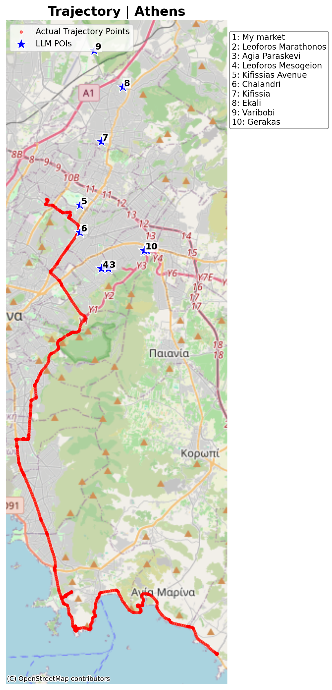
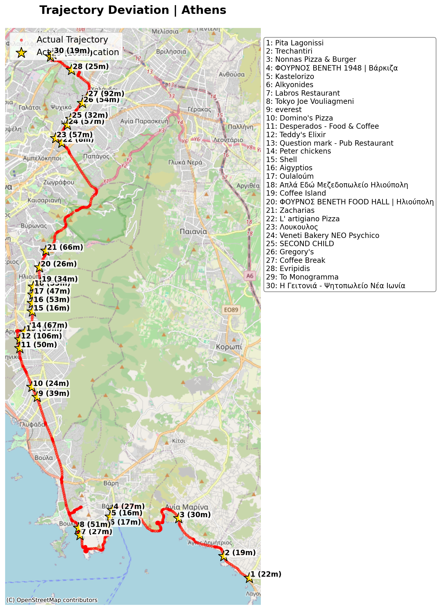
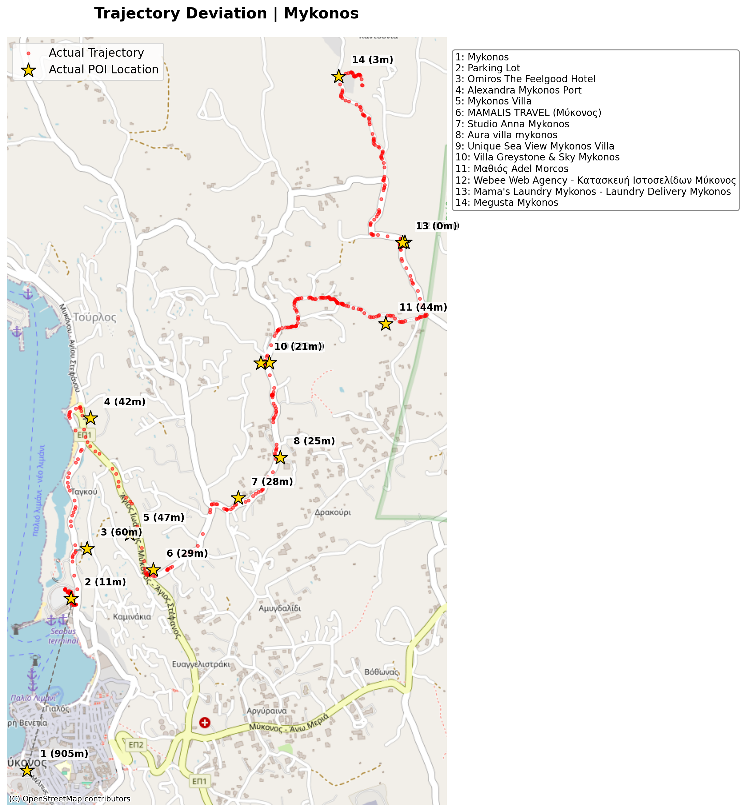
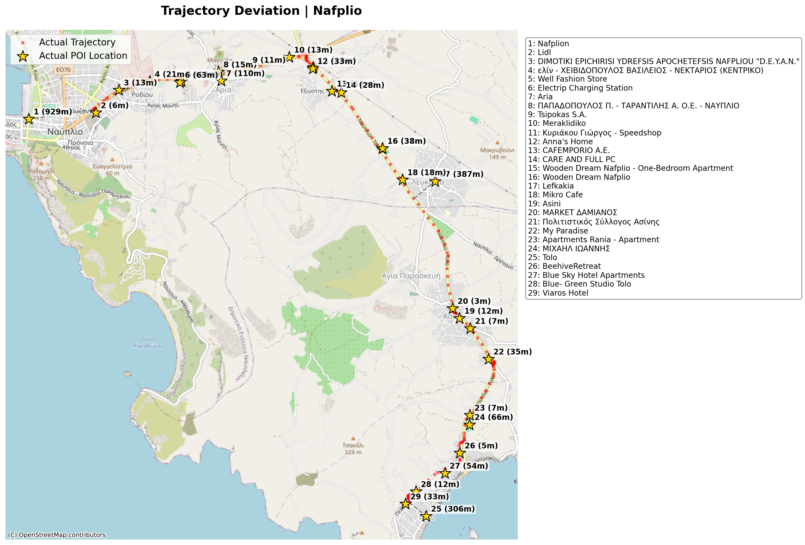
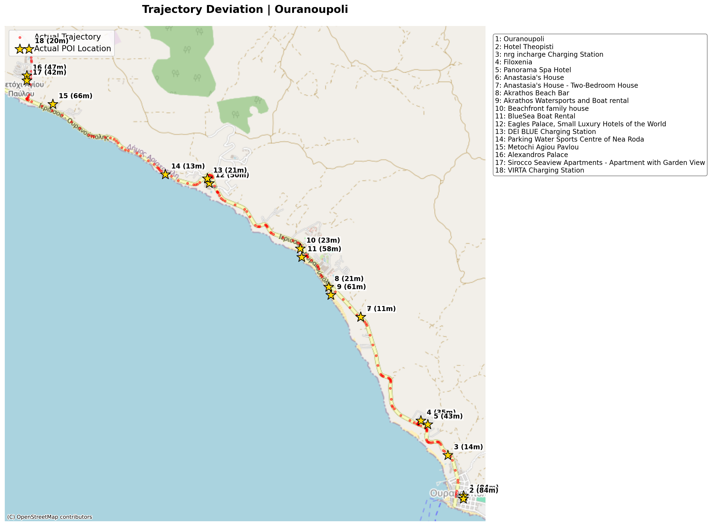
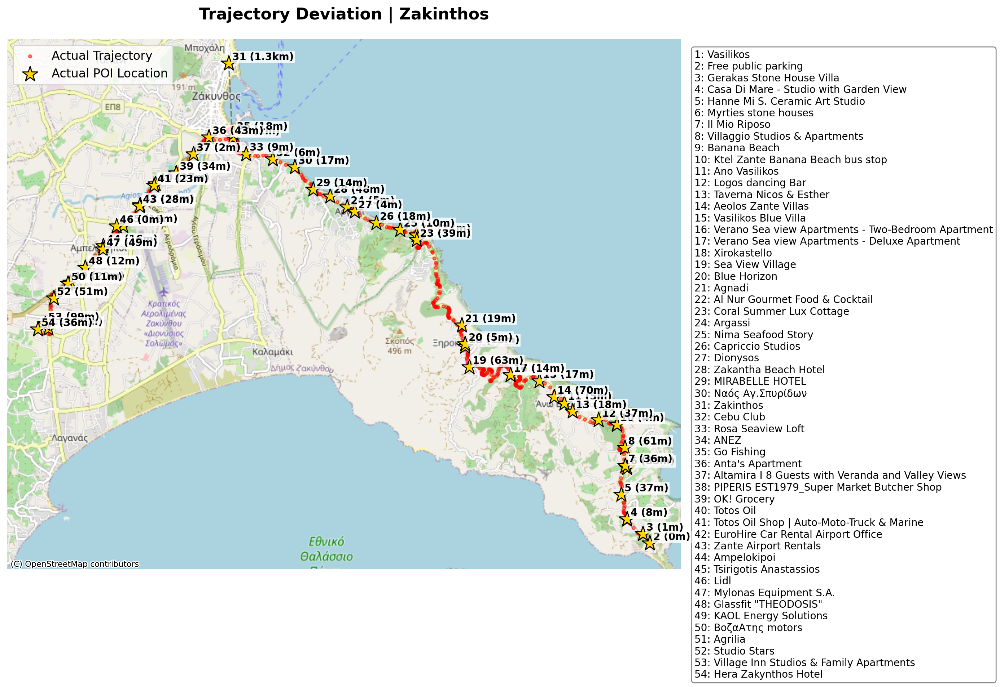
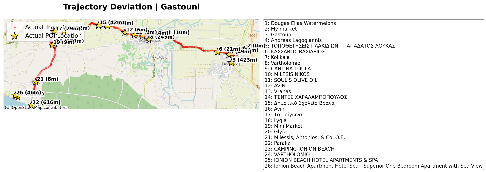
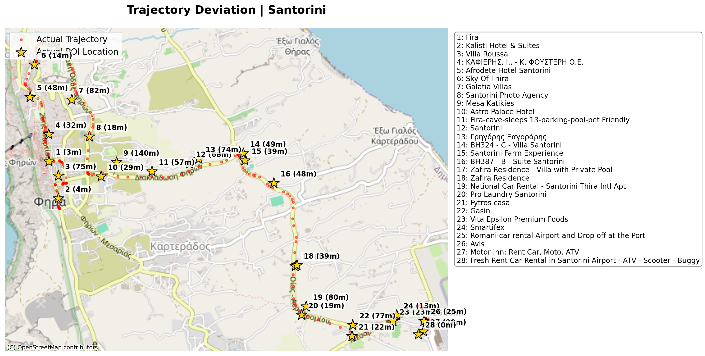
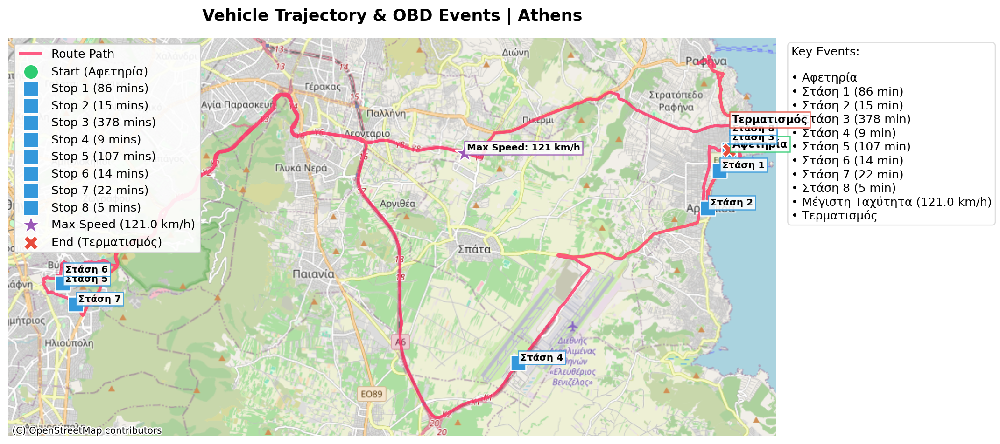

# GeoMuse

Το **GeoMuse** αποτελεί μια υλοποίηση βασισμένη στο ερευνητικό άρθρο: [*MapMuse: Comprehending Spatio-temporal Data via Cinematic Storytelling Generation using Large Language Models*](https://dl.acm.org/doi/10.1145/3748777.3748787). 

Ο βασικός στόχος του project είναι η αξιολόγηση και ο μετριασμός των "Παραισθήσεων" σε LLMs. Εξετάζεται κατά πόσο το μοντέλο μπορεί να κατανοήσει οπτικά χωρικά δεδομένα (όπως heatmaps και διαδρομές οχημάτων) και να παράγει ακριβείς γεωγραφικά ιστορίες, χωρίς να τοποθετεί τα γεγονότα αυθαίρετα σε διάσημα αξιοθέατα (landmarks) που δεν σχετίζονται με την εικόνα.


Η έρευνα έχει δομηθεί μέσα από μια σειρά αυτόνομων πειραμάτων (tests).

---

## test_01: Δημιουργία Βασικών Heatmaps (Πόρτο)

Στο πρώτο πείραμα, στόχος ήταν η μετατροπή των ακατέργαστων δεδομένων (raw data) σε οπτική πληροφορία. Χρησιμοποιήθηκε το [**Kaggle Taxi Trajectory Dataset**](https://www.kaggle.com/datasets/crailtap/taxi-trajectory) και τα δεδομένα των διαδρομών ταξί της πόλης του Πόρτο φορτώθηκαν σε μια βάση δεδομένων PostGIS. Από εκεί, εξήχθησαν τα τελικά σημεία (endpoints) των διαδρομών και παρήχθησαν εικόνες Heatmap υψηλής ανάλυσης. 

Δοκιμάστηκαν διάφορες μέθοδοι κανονικοποίησης (Standard, Logarithmic, Linear) προκειμένου να διαπιστωθεί ποια απεικονίζει καλύτερα την πυκνότητα. Αυτές οι εικόνες αποτελούν το βασικό υλικό (input) που δόθηκε στο LLM στα επόμενα στάδια. Σημειώνεται ότι κατά τη χρήση αυτών των παραλλαγών από το LLM, δεν παρατηρήθηκαν ουσιαστικές διαφορές στην τελική αφήγηση.

**Παραγόμενες Εικόνες:**

*Standard Heatmap:*  
<div align="center"><a href="common/heatmaps/endpoints_heatmap_porto.png" target="_blank"></a></div>

*Linear-Normalized Heatmap:*  
<div align="center"><a href="common/heatmaps/endpoints_heatmap_porto_linear.png" target="_blank"></a></div>

*Logarithmic Heatmap:*  
<div align="center"><a href="common/heatmaps/endpoints_heatmap_porto_log.png" target="_blank"></a></div>

---

## test_02: Επικάλυψη Heatmap σε Χάρτη (Map Overlay)

Στο δεύτερο πείραμα το παραγόμενο heatmap του `test_01` επικαλύφθηκε (overlay) πάνω σε έναν πραγματικό χάρτη του Πόρτο. Αυτή η εικόνα επιτρέπει στο μοντέλο να ταυτίσει την δραστηριότητα με πραγματικούς δρόμους και γειτονιές. Η εικόνα αυτή χρησιμοποιήθηκε ως είσοδος σε όλα τα υπόλοιπα πειράματα που αφορούν heatmaps.

**Παραγόμενη Εικόνα (Overlay):**

<div align="center"><a href="common/heatmaps/endpoints_heatmap_porto_overlay.png" target="_blank"></a></div>

---

## test_03: Παραγωγή Αφήγησης από το Heatmap

Δόθηκε στο μοντέλο η εικόνα που παρήχθη στο `test_02` και του ζητήθηκε να λειτουργήσει ως αφηγητής, εντοπίζοντας τα σημεία έντονης δραστηριότητας (hotspots) και γράφοντας μια ιστορία για αυτά. 

Σε αυτό το στάδιο δοκιμάστηκαν διαφορετικά Prompts για την εξαγωγή διαφορετικών στυλ ιστοριών:
* `HEATMAP_PROFESSIONAL_PROMPT`
* `HEATMAP_VISITOR_PROMPT`
* `HEATMAP_UNBIASED_PROMPT`

Τελικά επιλέχθηκε και καθιερώθηκε το **`HEATMAP_UNBIASED_PROMPT`**. Ο λόγος είναι ότι στα αρχικά prompts (π.χ. Visitor) υπήρχε ρητή αναφορά του ονόματος της πόλης. Σε δοκιμές που πραγματοποιήθηκαν με χάρτες άλλων περιοχών (π.χ. Αθήνα), διαπιστώθηκε ότι το LLM συνέχιζε να επιστρέφει POIs από το Πόρτο, αγνοώντας τα δεδομένα της εικόνας. Αυτό αποτελεί ένδειξη ότι το κείμενο του prompt υπερισχύει της οπτικής πληροφορίας ή ότι το μοντέλο δυσκολεύεται να αναγνωρίσει τη γεωγραφία αποκλειστικά από την εικόνα. Το Unbiased prompt αφαιρεί το όνομα της χώρας/πόλης, αναγκάζοντας το LLM να βασιστεί αποκλειστικά στα οπτικά δεδομένα για την ταυτοποίηση της τοποθεσίας. 

Ζητήθηκε επίσης η ταυτόχρονη εξαγωγή των POIs (Σημεία Ενδιαφέροντος) που εντόπισε το μοντέλο στην εικόνα σε μορφή JSON.

**HEATMAP_UNBIASED_PROMPT:**
```text
I will provide a PNG image representing a taxi activity heatmap. 
Your task is to act as an unbiased Geospatial Storyteller.
1. Identify the city and country shown in the base map.
2. Visually scan the image to find the exact area(s) where the bright heatmap color density is highest.
3. Note the geographic position of these specific hotspots.
4. Extract at least 15 POIs, landmarks, hospitals, or streets that are located EXACTLY underneath these visible hotspots.
...
```

**Δείγμα Εξαγόμενου JSON:**
```json
{
    "pois": [
        {
            "name": "São Bento Station"
        },
        {
            "name": "Clérigos Tower"
        },
        {
            "name": "Livraria Lello"
        }
    ]
}
```

**Παραγόμενη Ιστορία:**

> (A slow, sweeping shot reveals Porto at night, a dazzling network of golden lights pulsing across the map, each spark a taxi's endpoint, guiding your journey.)
> 
> Imagine Porto’s vibrant heartbeat, illuminated by the paths of discovery. Your adventure begins where the glow is brightest. Step out at **São Bento Train Station**, marveling at its iconic azulejo tiles. Follow the pulse to **Avenida dos Aliados**, Porto's grand central boulevard, leading to the soaring **Clérigos Tower** for breathtaking city views. Nearby, the enchanting **Livraria Lello** (a literary inspiration) beckons.
> 
> The vibrant hum guides you past the bustling **Mercado do Bolhão** (local culinary delights) and along **Rua de Santa Catarina**, home to the opulent **Café Majestic**. Descend to the historic **Porto Cathedral (Sé)** for panoramic vistas, then explore the exquisite **Palácio da Bolsa** with its stunning Arabian Room. The strongest glow leads to the riverside **Ribeira District**, a UNESCO site perfect for dining beside the majestic **Dom Luís I Bridge**.
> 
> Cross to Gaia for the famous **Port Wine Cellars** (essential tastings) and a scenic ride on the **Telefèrico de Gaia**. Westward, the lights guide you to the chic **Foz do Douro** beaches for sunsets, the serene **Serralves Museum** (modern art and gardens), and the architectural wonder of **Casa da Música** at **Rotunda da Boavista**, a major hub. Even **Campanhã Station**, a key transport link, and **Estádio do Dragão** (football fervor) have their bright spots. Let these vibrant paths illuminate your unforgettable Porto journey!

**Συμπέρασμα:** 
Το μοντέλο αναγνώρισε την πόλη και παρήγαγε μια αφήγηση. Ωστόσο, όπως αποδεικνύεται στα επόμενα πειράματα, το μοντέλο βασίστηκε στην εσωτερική του γνώση για τα πιο διάσημα τουριστικά μέρη του Πόρτο (π.χ. **São Bento Train Station** ή **Clérigos Tower**), αγνοώντας σε μεγάλο βαθμό το πραγματικό heatmap.

---

## test_04: Οπτικοποίηση των POIs

Στο στάδιο αυτό, πραγματοποιείται η οπτικοποίηση των Σημείων Ενδιαφέροντος (POIs) που εξήχθησαν από το LLM στο `test_03`. Τα σημεία αυτά αποτυπώνονται πάνω στον χάρτη του Πόρτο για να διαπιστωθεί οπτικά αν ταυτίζονται με τις περιοχές υψηλής δραστηριότητας.

Όπως φαίνεται στην παρακάτω εικόνα, τα POIs που πρότεινε το μοντέλο συμπίπτουν σε μεγάλο βαθμό με το heatmap. Αυτό είναι αναμενόμενο, καθώς τα σημεία αποβίβασης των ταξί (endpoints) συγκεντρώνονται φυσιολογικά γύρω από τα κυριότερα αξιοθέατα και σημεία ενδιαφέροντος της πόλης.

**Παραγόμενη Εικόνα:**
<div align="center"><a href="common/stories/porto_poi_map.png" target="_blank"></a></div>

---

## test_05: Παραγωγή Αφήγησης από Διαδρομή (Trajectory)

Χρησιμοποιώντας το αρχείο `trajectory.csv`, η διαδρομή απεικονίστηκε αρχικά στον χάρτη (κόκκινες τελείες). Στη συνέχεια, το περιεχόμενο του CSV δόθηκε ως είσοδος στο LLM μαζί με το παρακάτω prompt, ώστε το μοντέλο να περιγράψει μια συνεχή διαδρομή ταξί στο Πόρτο. Όπως και στα Heatmaps, εξάγονται τα POIs και οπτικοποιούνται πάνω στον χάρτη.

**TRAJECTORY_STORY_PROMPT:**
```text
I will provide a cvs file that contains a list of points
(longitude, latitude), that describe a trajectory of a taxi trip. Using
cinematic storytelling write a story about the trajectory. Mention
explicitly major road names, intersections, neighborhoods, local
POIs (e.g., restaurant name). Use 150 words maximum.
```

Όπως είναι εμφανές στην παρακάτω οπτικοποίηση, τα POIs που προτείνει το μοντέλο (μπλε αστέρια) εμφανίζονται σε εντελώς άσχετα σημεία σε σχέση με την πραγματική διαδρομή (κόκκινες τελείες). Αυτό επιβεβαιώνει την αδυναμία του μοντέλου να "δει" την ακριβή θέση της διαδρομής στην εικόνα, επιστρέφοντας πάλι τυχαία γνωστά σημεία της πόλης.

**Παραγόμενη Εικόνα:**
<div align="center"><a href="common/stories/porto_trajectory_map.png" target="_blank"></a></div>

**Δείγμα Παραγόμενης Ιστορίας:**
> The taxi idled by Ribeira’s ancient stones, overlooking the Douro. With a surge, it climbed steep Rua de São João, past flickering lamplight. We sped north through Cedofeita, art galleries blurring, then onto Avenida da Boavista, Casa da Música a futuristic marvel...

**Δείγμα Εξαγόμενων POIs (JSON):**
```json
[
    {
        "name": "Ribeira",
        "lon": -8.6138,
        "lat": 41.1408
    },
    {
        "name": "Rua de São João",
        "lon": -8.6115,
        "lat": 41.1415
    }
]
```

### test_05_2: Επέκταση στην Αθήνα
Πραγματοποιήθηκε δοκιμή με νέα διαδρομή στην Αθήνα (`trajectory_2.csv`). Τα αποτελέσματα επιβεβαίωσαν την αρχική παρατήρηση: το μοντέλο αδυνατεί να ακολουθήσει τη διαδρομή οπτικά και προτείνει τυχαία σημεία.

**Παραγόμενη Εικόνα (Αθήνα):**
<div align="center"><a href="common/stories/athens_trajectory_2_map.png" target="_blank"></a></div>

---

---

## test_06 & test_07: Πείραμα με "Ψεύτικα" (Fake) Hotspots (Πόρτο & Αθήνα)


Προκειμένου να αποδειχθεί αν το μοντέλο βασίζεται πραγματικά στην οπτική πληροφορία της εικόνας ή αν απλά "μαντεύει" βάσει της τοποθεσίας, δημιουργήθηκαν τεχνητά (fake) heatmaps. Σε αυτούς τους χάρτες, η δραστηριότητα μεταφέρθηκε σκόπιμα σε απομακρυσμένες περιοχές (βορειοανατολικά στο Πόρτο και στην περιοχή της Ραφήνας στην Αττική).

Χρησιμοποιήθηκε το **`HEATMAP_UNBIASED_PROMPT`**, το οποίο δεν αποκαλύπτει το όνομα της πόλης, αναγκάζοντας το μοντέλο να "σαρώσει" οπτικά την εικόνα.

**Αποτελέσματα:**
* Στο Πόρτο, το μοντέλο αγνόησε το ιστορικό κέντρο και εστίασε στην περιοχή όπου βρισκόταν η fake κηλίδα.
* Στην Αθήνα, το μοντέλο αναγνώρισε την πόλη και περιέγραψε μια ιστορία γύρω από την περιοχή της Ραφήνας, αγνοώντας πλήρως την Ακρόπολη και το κέντρο.

### Πείραμα Πόρτο (Fake Hotspot)

**Είσοδος (Fake Heatmap):**
<div align="center">
  <p>Fake Heatmap Πόρτο</p>
  <a href="common/heatmaps/endpoints_heatmap_porto_fake.png" target="_blank"></a>
</div>

**Αποτέλεσμα (Οπτικοποίηση POIs):**
<div align="center">
  <p>Fake Hotspot Πόρτο (Unbiased Output)</p>
  <a href="common/stories/porto_fake_map_unbiased.png" target="_blank"></a>
</div>

**Παραγόμενη Ιστορία (Porto Fake):**
> Welcome to **Porto, Portugal**! As you look at this heatmap, you'll notice a singular, intense beacon of activity, far from the historic downtown. This vibrant hotspot pulses in the northeastern part of the map, primarily encompassing the municipalities of **Maia** and **Valongo**, centered around the bustling area of **Águas Santas**.
> Imagine stepping into this dynamic zone. The brightest magenta core indicates a constant flow around major retail hubs like **Maia Shopping**, **Fórum Maia**, and the **Centro Comercial Parque da Maia**, where locals frequent **local supermarkets** and big-box stores like **Leroy Merlin Maia** and **Decathlon Maia**.

---

### Πείραμα Αθήνας (Fake Hotspot)
<div align="center">
  <p>Fake Heatmap Αθήνα (Περιοχή Ραφήνας)</p>
  <a href="common/heatmaps/endpoints_heatmap_athens_fake.png" target="_blank"></a>
</div>

**Αποτέλεσμα (Οπτικοποίηση POIs):**
<div align="center">
  <p>Fake Hotspot Αθήνα (Unbiased Output)</p>
  <a href="common/stories/athens_fake_map_athens_unbiased.png" target="_blank"></a>
</div>

**Παραγόμενη Ιστορία (Athens Fake):**
> The predawn hum of engines, the splash of waves – welcome to the vibrant heartbeat of **Rafina**, Greece. This isn't the ancient city center you might expect, but a bustling coastal hub, revealed by the radiant glow of taxi activity on our map.
> Our data tells a story of constant motion around **Rafina Port**, the primary gateway to the Cycladic islands, making it a hotspot for arrivals and departures. Taxis converge here, weaving through **Ethniki Odos Rafinas** and **Dimokratias Avenue**, ferrying travelers and locals.


---

## test_08 - test_11: Αξιολόγηση Geocoding & Validation Layer

**Περιγραφή:**
Για την επικύρωση των POIs που προτείνει το LLM, γίνεται σύγκριση των συντεταγμένων που "φαντάζεται" το μοντέλο με τις πραγματικές συντεταγμένες. 

Στα **tests 08, 09 και 10** πραγματοποιήθηκαν δοκιμές με τους 3 κυριότερους "free" (ή freemium) geocoders, ενώ στο **test 11** έγινε η συγκριτική τους αξιολόγηση:
1. **Google Geocoding API**
2. **Nominatim (OpenStreetMap)**
3. **ArcGIS**

**Συμπέρασμα Αξιολόγησης:**
Το **Google Geocoding API** αποδείχθηκε η πιο αξιόπιστη λύση. Παρόλο που το LLM συχνά παρέχει ονόματα με μικρά σφάλματα ή ασαφείς περιγραφές, η Google κατάφερε να ταυτοποιήσει τα σημεία με τη μεγαλύτερη ακρίβεια, επιτρέποντας τον υπολογισμό της απόκλισης (deviation). 

**Χάρτες Σύγκρισης (LLM vs API):**
Οι παρακάτω χάρτες δείχνουν τη διαφορά μεταξύ της θέσης που "νόμιζε" το LLM (μπλε σημεία) και της πραγματικής θέσης που επιβεβαίωσε το API (κίτρινα αστέρια).

<div align="center">
  <p>Σύγκριση Πόρτο (LLM vs Google)</p>
  <a href="common/stories/porto_google_comparison_map.png" target="_blank"></a>
  <br><br>
  <p>Σύγκριση Αθήνα (LLM vs Google)</p>
  <a href="common/stories/athens_google_comparison_map.png" target="_blank"></a>
</div>

**Δείγμα JSON Αξιολόγησης (test_11):**
```json
[
    {
        "name": "Google",
        "hits": 11,
        "total": 11,
        "results": [
            {
                "name": "Ribeira",
                "llm_lon": -8.6138,
                "llm_lat": 41.1408,
                "api_lon": -8.6103135,
                "api_lat": 41.1432682,
                "diff_distance_meters": 401.0
            }
        ]
    }
]
```

---

## test_12: Αξιολόγηση (Deviation Calculation)

Στο test αυτό πραγματοποιείται η μέτρηση των αποτελεσμάτων του `test_05`. Ενώ στο `test_05` η απόκλιση ήταν ορατή μόνο οπτικά, εδώ υπολογίζεται με ακρίβεια η απόκλιση (deviation) σε μέτρα κάθε POI από την πραγματική διαδρομή (trajectory).


**Παραγόμενη Εικόνα (Deviation Map):**
<div align="center"><a href="common/stories/porto_trajectory_deviation_map.png" target="_blank"></a></div>

**Δείγμα JSON Αποτελεσμάτων (test_12):**
```json
[
    {
        "name": "Hospital de São João",
        "llm_lon": -8.595,
        "llm_lat": 41.184,
        "api_lon": -8.6008841,
        "api_lat": 41.1816284,
        "diff_distance_meters": 559.6,
        "distance_to_trajectory_meters": 523.2
    }
]
```

**Επεξήγηση Πεδίων JSON:**
* **llm_lon/lat**: Οι συντεταγμένες που "μάντεψε" το μοντέλο.
* **api_lon/lat**: Οι πραγματικές συντεταγμένες από το Google.
* **diff_distance_meters**: Η απόσταση μεταξύ των δύο παραπάνω.
* **distance_to_trajectory_meters**: Η απόσταση του POI από το πλησιέστερο (nearest) σημείο της πραγματικής διαδρομής.

---

## test_14: Agentic Workflow (Self-Correction)


Στο test αυτό, εφαρμόστηκε ένας μηχανισμός αυτο-διόρθωσης. Ο **Control Agent** υπολογίζει την απόκλιση και, αν αυτή υπερβαίνει ένα όριο (π.χ. 200 μέτρα), ζητά από το μοντέλο να ξαναγράψει την ιστορία, παρέχοντάς του το σκορ της απόκλισης ως feedback.

**Αποτέλεσμα:**
Το μοντέλο, παρόλο που προσπάθησε να συμμορφωθεί, απέτυχε να μειώσει την απόκλιση σημαντικά. Αυτό απέδειξε ότι η ανατροφοδότηση από μόνη της δεν αρκεί αν το μοντέλο δεν έχει πρόσβαση σε εξωτερική γνώση (μέσω κάποιου API).

**Χάρτης Απόκλισης (Self-Correction):**
<div align="center"><a href="common/stories/porto_agentic_story_map.png" target="_blank"></a></div>

**Δείγμα JSON Αποτελεσμάτων (test_14):**
```json
{
    "title": "The Douro Dawn Drive",
    "pois": [
        {
            "name": "Hospital de São João",
            "distance_to_trajectory_meters": 523.2
        },
        {
            "name": "Ribeira",
            "distance_to_trajectory_meters": 4463.4
        }
    ]
}
```

---

## test_15: Agentic RAG Workflow (Spatial Grounding)

Αποτελεί την πιο επιτυχημένη προσέγγιση. Χρησιμοποιείται ο **Discovery Agent** ο οποίος, πριν την κλήση του LLM, αναζητά μέσω του **Google Places API** πραγματικά POIs που βρίσκονται αυστηρά πάνω στη διαδρομή. Αυτά τα σημεία παρέχονται στο prompt ως grounding.

**Αποτέλεσμα:**
Η απόκλιση εκμηδενίστηκε (κάτω από 100 μέτρα). Το μοντέλο ενσωμάτωσε τα πραγματικά POIs στην αφήγηση, παράγοντας μια ιστορία που είναι γεωγραφικά ακριβής και ταυτίζεται απόλυτα με την εικόνα της διαδρομής.

**Χάρτης Απόκλισης:**
<div align="center"><a href="common/stories/porto_agentic_rag_story_map.png" target="_blank"></a></div>

### test_15_2: Επέκταση στην Αθήνα.
Η ίδια μέθοδος εφαρμόστηκε στη διαδρομή της Αθήνας. Ο **Discovery Agent** εντόπισε 30 POIs κατά μήκος της διαδρομής και το μοντέλο πέτυχε μέση απόκλιση < 100 μέτρων.

**Χάρτης Απόκλισης (Αθήνα):**
<div align="center"><a href="common/stories/athens_agentic_rag_story_map.png" target="_blank"></a></div>

**Παραγόμενη Ιστορία (Athens RAG):**

> The early morning sun was already warm as Maria stepped into the waiting taxi, eager to explore Athens. Her first stop was a quick breakfast, and the driver recommended a local favorite. They pulled up to **Pita Lagonissi**, where she grabbed a delicious savory pie to go. As they continued their journey along the scenic coastal road, she admired the view, passing by the charming **Trechantiri** restaurant, its tables already being set for lunch.
>
> The ride continued, and soon they were near **Nonnas Pizza & Burger**, a vibrant spot that promised a different kind of meal. Maria, however, had a craving for something more traditional. The taxi then made a slight detour, stopping briefly near **ΦΟΥΡΝΟΣ ΒΕΝΕΤΗ 1948 | Βάρκιζα**, a bakery whose aroma filled the air. Just a stone's throw away, she spotted the elegant **Kastelorizo** restaurant, a place she mentally bookmarked for a future visit. A little further, the relaxed vibe of **Alkyonides** cafe caught her eye, perfect for an afternoon coffee.
>
> The journey took them further along the coast, past the renowned **Labros Restaurant**, known for its fresh seafood. A few minutes later, they drove past **Tokyo Joe Vouliagmeni**, a modern sushi spot contrasting with the traditional Greek tavernas.
>
> As they turned inland and headed north, the scenery shifted from coastal views to bustling city streets. Maria noticed an **everest** cafe, a familiar sight, indicating they were now deep within the urban sprawl. Soon after, the bright red sign of **Domino's Pizza** flashed by, a reminder of global comfort food.
>
> The taxi continued its steady climb north. They passed **Desperados - Food & Coffee**, a lively-looking spot, followed shortly by the quirky **Teddy's Elixir**. The driver pointed out **Question mark - Pub Restaurant**, a popular evening hangout. Lunchtime was approaching, and the scent of grilled meat wafted from **Peter chickens**.
>
> A necessary stop for the driver came next at a **Shell** gas station, where Maria stretched her legs. Refreshed, they resumed their journey, passing the inviting facade of **Aigyptios** restaurant. The city's culinary diversity was evident as they then saw **Oulaloúm**, another intriguing eatery. They soon reached the area of Ilioupoli, marked by the traditional charm of **Απλά Εδώ Μεζεδοπωλείο Ηλιούπολη**.
>
> Maria decided a coffee break was in order and asked the driver to pull over near a **Coffee Island**. After a quick caffeine fix, they continued, passing another familiar bakery, **ΦΟΥΡΝΟΣ ΒΕΝΕΤΗ FOOD HALL | Ηλιούπολη**. The journey was long, but Maria enjoyed observing the city life. They drove past **Zacharias**, a restaurant that looked like a local institution.
>
> The final leg of her journey took them even further north. They passed **L' artigiano Pizza**, a tempting stop for Italian fare, and then the traditional Greek restaurant **Λουκουλος**. The driver then navigated through Neo Psychico, where they spotted **Veneti Bakery NEO Psychico**, another branch of the popular bakery chain. Nearby, the trendy **SECOND CHILD** bar caught her attention.
>
> As they neared her final destination, they passed a **Gregory's** cafe, a convenient spot for a quick bite, and then **Coffee Break**, another place to grab a refreshment. The taxi was now in the northern suburbs. They drove past **Evripidis**, a restaurant with a classic feel, and then **To Monogramma**, a place that seemed to promise a unique dining experience. Finally, the taxi pulled up to **Η Γειτονιά - Ψητοπωλείο Νέα Ιωνία**, her destination, where friends were waiting for a celebratory meal. What a journey it had been!

### test_15_3: Επέκταση στην Μύκονο.
Η ίδια μέθοδος εφαρμόστηκε στη διαδρομή της Μυκόνου. Ο **Discovery Agent** εντόπισε 14 πραγματικά POIs. Το μοντέλο τα ενσωμάτωσε όλα στην ιστορία του και πέτυχε μέση απόκλιση 89.4 μέτρων.

**Χάρτης Απόκλισης (Μύκονος):**
<div align="center"><a href="common/stories/mykonos_1_agentic_rag_story_map.png" target="_blank"></a></div>

**Παραγόμενη Ιστορία (Mykonos RAG):**

> The warm Aegean breeze greeted me as I stepped out, ready to explore the vibrant island of Mykonos. My taxi was waiting, and we pulled out of the bustling **Parking Lot**, the first specific stop on my journey. The driver, a friendly local, navigated the winding roads with ease. We passed by **Omiros The Feelgood Hotel**, its charming facade hinting at comfortable stays, and then the **Alexandra Mykonos Port**, where ferries docked, bringing more visitors to this beautiful island.
>
> As we continued, I caught a glimpse of a secluded **Mykonos Villa**, imagining the peaceful retreats it offered. A bit further, we drove past **MAMALIS TRAVEL (Μύκονος)**, a reminder of all the adventures awaiting tourists. The taxi then took us past **Studio Anna Mykonos**, another inviting place for travelers to rest. The landscape began to open up, revealing more stunning views. We soon approached **Aura villa mykonos**, its architecture blending seamlessly with the island's aesthetic.
>
> The driver pointed out the breathtaking vistas as we neared the **Unique Sea View Mykonos Villa**, a truly picturesque spot. Just a stone's throw away was **Villa Greystone & Sky Mykonos**, another testament to the island's luxurious accommodations. Our journey continued, and we passed by a place simply marked as **Μαθιός Adel Morcos**, a local landmark or residence.
>
> As we ventured further, the island's diverse offerings became apparent. We drove past **Webee Web Agency - Κατασκευή Ιστοσελίδων Μύκονος**, a modern touch amidst the traditional charm, and then **Mama's Laundry Mykonos - Laundry Delivery Mykonos**, a practical service for island life. Finally, my destination came into view: **Megusta Mykonos**. The taxi pulled up, and I stepped out, ready to begin my tranquil Mykonian escape, having seen so much of the island's character along the way.

### test_15_4: Επέκταση στο Ναύπλιο.
Η μέθοδος εφαρμόστηκε και στη διαδρομή Ναύπλιο - Τολό. Ο **Discovery Agent** εντόπισε 29 πραγματικά POIs. Το μοντέλο ενσωμάτωσε όλα αυτά τα σημεία δημιουργώντας μια αφήγηση με μέση απόκλιση 82.4 μέτρων.

**Χάρτης Απόκλισης (Ναύπλιο):**
<div align="center"><a href="common/stories/nafplio_1_agentic_rag_story_map.png" target="_blank"></a></div>

**Παραγόμενη Ιστορία (Nafplio RAG):**

> The morning sun was already warm as I settled into the taxi, leaving the picturesque old town of **Nafplion** behind. My driver, a friendly man named Yiannis, nodded a greeting as we pulled away. Our journey began, and soon we were passing the familiar blue and yellow sign of **Lidl**, a reminder that even in this ancient land, modern conveniences were never far. We continued, briefly passing the local water and sewage company, **DIMOTIKI EPICHIRISI YDREFSIS APOCHETEFSIS NAFPLIOU "D.E.Y.A.N."**, a testament to the essential services that keep a town running. Yiannis then made a quick stop at the **ελίν - ΧΕΙΒΙΔΟΠΟΥΛΟΣ ΒΑΣΙΛΕΙΟΣ - ΝΕΚΤΑΡΙΟΣ (ΚΕΝΤΡΙΚΟ)** gas station, topping up the tank for our trip. As we resumed our drive, I caught a glimpse of the latest trends at the **Well Fashion Store** and noticed the sleek **Electrip Charging Station**, a sign of Greece's move towards greener transport. 
>
> Soon, the landscape shifted slightly as we entered the locality of **Aria**, the buildings becoming a little more spread out. We drove past the commercial hub of **ΠΑΠΑΔΟΠΟΥΛΟΣ Π. - ΤΑΡΑΝΤΙΛΗΣ Α. Ο.Ε. - ΝΑΥΠΛΙΟ** and the business premises of **Tsipokas S.A.**, before a delightful aroma wafted through the open window – the unmistakable scent of fresh bread from **Meraklidiko** bakery. Further along, we passed **Κυριάκου Γιώργος - Speedshop**, a local car repair shop, and then a cozy looking residence, **Anna's Home**. The journey continued, taking us past **CAFEMPORIO A.E.** and the **CARE AND FULL PC** shopping mall, bustling with early morning activity. My thoughts drifted to other travelers as we passed the inviting **Wooden Dream Nafplio - One-Bedroom Apartment** and then the main **Wooden Dream Nafplio** complex, imagining guests enjoying their stay. 
>
> We soon found ourselves in the charming locality of **Lefkakia**, where a quaint **Mikro Cafe** beckoned with promises of strong Greek coffee. Our route then led us into **Asini**, a place with a quiet, authentic feel. We passed **MARKET ΔΑΜΙΑΝΟΣ**, where locals were already doing their shopping, and the modest building of the **Πολιτιστικός Σύλλογος Ασίνης**, a hub for local culture. As we neared our final destination, we passed by various accommodations like **My Paradise** and **Apartments Rania - Apartment**, and a general establishment named **ΜΙΧΑΗΛ ΙΩΑΝΝΗΣ**. Finally, the sparkling blue waters of the Argolic Gulf came into full view, signaling our arrival in **Tolo**. We drove through the vibrant coastal town, passing the charming **BeehiveRetreat**, the welcoming **Blue Sky Hotel Apartments**, and the cozy **Blue- Green Studio Tolo**, before Yiannis pulled up smoothly in front of my own destination, the **Viaros Hotel**. "Here we are," he smiled, and I stepped out, ready to embrace the beauty of Tolo.

### test_15_5: Επέκταση στην Ουρανούπολη.
Η διαδικασία επαναλήφθηκε για την παραλιακή διαδρομή της Ουρανούπολης. Ο **Discovery Agent** ανακάλυψε 18 πραγματικά POIs κατά μήκος της διαδρομής. Το μοντέλο ενσωμάτωσε και τα 18 σημεία στην αφήγηση, πετυχαίνοντας  μέση απόκλιση 39.6 μέτρων.

**Χάρτης Απόκλισης (Ουρανούπολη):**
<div align="center"><a href="common/stories/ouranoupoli_1_agentic_rag_story_map.png" target="_blank"></a></div>

**Παραγόμενη Ιστορία (Ouranoupoli RAG):**

> The morning sun was already warm as I settled into the taxi in **Ouranoupoli**, ready for a leisurely drive along the coast. My driver, a friendly local named Yiannis, confirmed my destination. We smoothly pulled away from the curb, passing by the charming **Hotel Theopisti** almost immediately. Just a bit further, Yiannis pointed out the **nrg incharge Charging Station**, mentioning how useful it was for electric taxis like his.
>
> Our journey continued, revealing more of the beautiful Halkidiki coastline. We drove past the welcoming facade of **Filoxenia**, and then, just a stone's throw away, the more opulent **Panorama Spa Hotel**, both bustling with early risers. The road wound gently, and soon we were near **Anastasia's House**, a lovely guesthouse, with Yiannis noting the specific **Anastasia's House - Two-Bedroom House** as a popular choice for families.
>
> A little further, the scent of the sea grew stronger, and we spotted the vibrant umbrellas of **Akrathos Beach Bar**, already preparing for the day's visitors. Right next to it was **Akrathos Watersports and Boat rental**, where a few early birds were already getting their gear ready. The scenery was breathtaking.
>
> We continued our drive, passing a charming **Beachfront family house** with a perfect view of the Aegean. Nearby, the **BlueSea Boat Rental** had a few small boats bobbing gently in the water. Soon, the landscape became grander as we approached the impressive **Eagles Palace, Small Luxury Hotels of the World**. Yiannis slowed slightly, pointing out the convenient **DEI BLUE Charging Station** tucked away nearby, a testament to the region's modern amenities.
>
> Our journey took us past the **Parking Water Sports Centre of Nea Roda**, where the promise of adventure hung in the air. As we entered the tranquil area of **Metochi Agiou Pavlou**, the pace seemed to slow, offering a glimpse into a more serene side of the peninsula. Finally, our destination came into view: the majestic **Alexandros Palace**. I thanked Yiannis as he pulled up, noting the nearby **Sirocco Seaview Apartments - Apartment with Garden View** as another excellent lodging option. As I stepped out, Yiannis mentioned he'd probably head to the **VIRTA Charging Station** next, ready for his next fare.

### test_15_6: Επέκταση στην Ζάκυνθο.
Στη διαδρομή της Ζακύνθου, ο **Discovery Agent** ανακάλυψε **54 POIs**. Το Agentic RAG αξιοποίησε αυτά τα δεδομένα και δημιούργησε μια αφήγηση ενσωματώνοντας όλα τα σημεία, επιτυγχάνοντας μέση απόκλιση μόλις 48.2 μέτρων.

**Χάρτης Απόκλισης (Ζάκυνθος):**
<div align="center"><a href="common/stories/zakinthos_1_agentic_rag_story_map.png" target="_blank"></a></div>

**Παραγόμενη Ιστορία (Zakinthos RAG):**

> The morning sun was already warm as Alex settled into the taxi, leaving the tranquil charm of **Vasilikos** behind. The driver, a friendly local named Yiannis, nodded a greeting, and they began their journey across the beautiful island of Zakynthos. Soon, they passed a convenient **Free public parking** area, a reminder of the island's bustling summer. Alex peered out the window, catching glimpses of various accommodations like the rustic **Gerakas Stone House Villa** and the inviting **Casa Di Mare - Studio with Garden View**, mentally noting places for future visits. A little further, the vibrant displays of **Hanne Mi S. Ceramic Art Studio** caught their eye, a potential stop for souvenirs.
>
> Their route continued, winding past more charming stays such as **Myrties stone houses**, the serene **Il Mio Riposo**, and the family-friendly **Villaggio Studios & Apartments**. The air grew saltier as they approached the coast, and soon, the golden sands of **Banana Beach** stretched out before them, a popular spot marked by the **Ktel Zante Banana Beach bus stop**. Yiannis briefly slowed, allowing Alex to take in the view before they continued through the heart of **Ano Vasilikos**. Nightlife beckoned with a quick glance at **Logos dancing Bar**, and the aroma of traditional Greek cooking wafted from **Taverna Nicos & Esther**.
>
> More picturesque villas dotted the landscape: **Aeolos Zante Villas** and the elegant **Vasilikos Blue Villa**. They then passed the **Verano Sea view Apartments**, noting both the **Two-Bedroom Apartment** and the **Deluxe Apartment** options. The scenery shifted slightly as they entered **Xirokastello**, where **Sea View Village** and **Blue Horizon** offered stunning vistas. Alex made a mental note of **Agnadi** and **Al Nur Gourmet Food & Cocktail** for their highly-rated cuisine, and then they passed the cozy **Coral Summer Lux Cottage**.
>
> Soon, the taxi entered the lively resort town of **Argassi**. The streets were abuzz, and Alex spotted **Nima Seafood Story**, a promising dining spot, and the comfortable **Capriccio Studios**. They drove past **Dionysos**, a popular cafe, and then the prominent **Zakantha Beach Hotel** and **MIRABELLE HOTEL**. A moment of quiet reverence came as they passed the beautiful **Ναός Αγ.Σπυρίδων**, the Church of St. Spyridon, a significant landmark.
>
> Their journey continued into the bustling capital, **Zakinthos** town itself. Here, the energy was palpable, with the **Cebu Club** promising lively evenings. Alex saw **Rosa Seaview Loft**, a modern stay, and the practical **ANEZ** travel agency. A quick stop for fishing supplies could be made at **Go Fishing**. They passed **Anta's Apartment** and the spacious **Altamira I 8 Guests with Veranda and Valley Views**, perfect for larger groups. Daily necessities were covered by the sight of **PIPERIS EST1979_Super Market Butcher Shop** and the convenient **OK! Grocery**. Further along, **Totos Oil** and its accompanying **Totos Oil Shop | Auto-Moto-Truck & Marine** provided essential services.
>
> As they neared the airport area, the presence of **EuroHire Car Rental Airport Office** and **Zante Airport Rentals** indicated their proximity to departure points. They drove through **Ampelokipoi**, a more residential and commercial area. Alex observed **Tsirigotis Anastassios**, a local store, and the familiar blue and yellow sign of **Lidl**. **Mylonas Equipment S.A.** and **Glassfit "THEODOSIS"** were signs of local businesses, as were **KAOL Energy Solutions** and **ΒοζαΑτης motors**. Finally, the taxi entered **Agrilia**, a quieter village. They passed **Studio Stars** and the welcoming **Village Inn Studios & Family Apartments** before pulling up to the **Hera Zakynthos Hotel**, Alex's destination, marking the end of a long but incredibly scenic and informative ride across Zakynthos.

### test_15_7: Επέκταση στην Γαστούνη.
Σε αυτό το πείραμα δοκιμάστηκε η διαδρομή στη Γαστούνη. Ο **Discovery Agent** ανέσυρε **26 POIs** κατά μήκος της διαδρομής. Το Agentic RAG αξιοποίησε τα δεδομένα, πετυχαίνοντας μέση απόκλιση **70.9 μέτρων**.

**Χάρτης Απόκλισης (Γαστούνη):**
<div align="center"><a href="common/stories/gastouni_1_agentic_rag_story_map.png" target="_blank"></a></div>

**Παραγόμενη Ιστορία (Gastouni RAG):**

> The morning sun was already warm as I settled into the taxi, the scent of fresh produce still lingering from my stop at **Dougas Elias Watermelons**. My first task was to grab some essentials, so the driver made a quick detour to **My market**. Soon, we were driving through the bustling heart of **Gastouni**, a town that felt both vibrant and steeped in history. As we navigated the streets, I spotted the establishment of **Andreas Lagogiannis**, a familiar name from my previous visits. We then passed by the distinctive sign for **ΤΟΠΟΘΕΤΗΣΕΙΣ ΠΛΑΚΙΔΙΩΝ - ΠΑΠΑΔΑΤΟΣ ΛΟΥΚΑΣ**, a local tile installer, and a little further, the general store of **ΚΑΣΣΑΒΟΣ ΒΑΣΙΛΕΙΟΣ**. The landscape began to change as we left the town, transitioning through the quiet locality of **Kokkala**, then into **Vartholomio**. The driver suggested a quick coffee break, and we pulled over at **CANTINA TOULA**, a charming little cafe. I grabbed a snack from **MILESIS NIKOS** nearby, and before getting back in, I made a mental note to visit **SOULIS OLIVE OIL** on my next trip for some local produce. 
>
> The taxi needed fuel, so we stopped at an **AVIN** gas station. Our journey continued, taking us through the peaceful village of **Vranas**, where I noticed the awnings of **ΤΈΝΤΕΣ ΧΑΡΑΛΑΜΠΟΠΟΥΛΟΣ** and the lively playground of the **Δημοτικό Σχολείο Βρανά**. We passed another **Avin** station, a sign of our progress. A little later, we paused briefly near **Το Τρίγωνο**, another cafe, before heading through the scenic locality of **Lygia**. I realized I'd forgotten sunscreen, so a quick stop at a **Mini Market** was essential. The air grew saltier as we approached the coast, passing through **Glyfa**, where I saw the business of **Milessis, Antonios, & Co. O.E.**. Finally, we reached the beautiful coastal area of **Paralia**. I caught glimpses of **CAMPING IONION BEACH** and a **VARTHOLOMIO** storage facility, knowing my destination was close. The taxi pulled up to the elegant **IONION BEACH HOTEL APARTMENTS & SPA**, and I couldn't wait to check into my **Ionion Beach Apartment Hotel Spa - Superior One-Bedroom Apartment with Sea View**, ready to enjoy the rest of my vacation.

### test_15_8: Επέκταση στην Σαντορίνη.
Στη διαδρομή της Σαντορίνης, ο **Discovery Agent** ανακάλυψε **28 POIs**. Το Agentic RAG αξιοποίησε τα δεδομένα και ενσωμάτωσε τα σημεία, πετυχαίνοντας μέση απόκλιση **40.7 μέτρων**.

**Χάρτης Απόκλισης (Σαντορίνη):**
<div align="center"><a href="common/stories/santorini_1_agentic_rag_story_map.png" target="_blank"></a></div>

**Παραγόμενη Ιστορία (Santorini RAG):**

> The Santorini sun was already warm as Maria settled into the taxi, leaving the bustling heart of **Fira** behind. She had just checked out of her charming guesthouse and was on her way to pick up a rental car for the rest of her island adventure. As the taxi navigated the winding streets, she caught glimpses of familiar names from her research, like the elegant **Kalisti Hotel & Suites** and the quaint **Villa Roussa**. The driver pointed out a local business, **ΚΑΦΙΕΡΗΣ, I., - Κ. ΦΟΥΣΤΕΡΗ Ο.Ε.**, a place known for its traditional goods, before they passed the inviting facades of **Afrodete Hotel Santorini** and the modern architecture of **Sky Of Thira**.
>
> The ride continued, offering views of more lovely stays such as **Galatia Villas**. Maria made a mental note to check out the **Santorini Photo Agency** later, thinking about capturing the island's beauty. They drove past the quiet residential area of **Mesa Katikies** and the luxurious **Astro Palace Hotel**, a place she hoped to stay on a future trip. The driver chuckled as they passed a unique listing, **Fira-cave-sleeps 13-parking-pool-pet Friendly**, before slowing down near a sparkling jewelry store simply named **Santorini**.
>
> Further along, they passed by **Γρηγόρης Ξαγοράρης** and the secluded **BH324 - C - Villa Santorini**, a perfect hideaway. Maria was intrigued by the concept of the **Santorini Farm Experience**, imagining fresh local produce. They then skirted past another beautiful stay, **BH387 - B - Suite Santorini**, before the landscape began to shift, becoming less dense with hotels and more focused on services.
>
> Soon, they were near the airport area. The taxi passed the impressive **Zafira Residence - Villa with Private Pool** and its sister property, **Zafira Residence**. Maria knew she was getting close when they drove by the **National Car Rental - Santorini Thira Intl Apt**. She spotted the practical **Pro Laundry Santorini**, a reminder of everyday life amidst the vacation vibe. The driver continued, passing **Fytros casa** and **Gasin**, before reaching **Vita Epsilon Premium Foods** and the tech-focused **Smartifex**. Finally, they arrived at the cluster of car rental agencies. Maria thanked the driver as he pulled up near **Romani car rental Airport and Drop off at the Port**, right next to the familiar blue logo of **Avis**. She saw **Motor Inn: Rent Car, Moto, ATV** and **Fresh Rent Car Rental in Santorini Airport - ATV - Scooter - Buggy** nearby, knowing she had plenty of options for her onward journey.

### test_16: Ανάλυση Τηλεμετρίας & OBD Διαδρομής
Σε αυτό το πείραμα αναλύθηκε μια διαδρομή οχήματος στην Αθήνα με δεδομένα OBD (On-board Diagnostics) και GPS. Από τον **Story Generator** παρήχθη ένα επίσημο τεχνικό report στα ελληνικά, ενσωματώνοντας την ανάλυση των ελάχιστων και μέγιστων τιμών των αισθητήρων του οχήματος, τη μέγιστη καταπόνηση του κινητήρα (ταχύτητα, στροφές RPM, φορτίο) και τις παραμέτρους τηλεμετρίας (τάση μπαταρίας, θερμοκρασία ψυκτικού, σήμα GPS). Η ανάκτηση των διευθύνσεων για τα συμβάντα και τις στάσεις της διαδρομής πραγματοποιήθηκε μέσω του **Discovery Agent** με χρήση του **Google Geocoding API**.

**Χάρτης Διαδρομής & Συμβάντων (Αθήνα OBD):**
<div align="center"><a href="common/stories/athens_obd_trajectory_map.png" target="_blank"></a></div>

**Παραγόμενη Τεχνική Αναφορά (Athens OBD Story):**

> ## Τεχνική Αναφορά Λειτουργίας & Τηλεμετρίας Οχήματος
> 
> **Ημερομηνία:** 11/05/2026  
> **Περιοχή:** Αττική, Ελλάδα  
> **Τύπος Αναφοράς:** Ανάλυση Τηλεμετρίας OBD & GPS  
> 
> ---
> 
> ### 1. Εισαγωγή & Μεθοδολογία
> Η παρούσα τεχνική αναφορά παρέχει μια λεπτομερή ανάλυση της λειτουργίας, της οδικής συμπεριφοράς και της κατάστασης των υποσυστημάτων του οχήματος κατά τη διάρκεια της καταγεγραμμένης διαδρομής της 11ης Μαΐου 2026. Η ανάλυση βασίζεται σε πραγματικά δεδομένα που συλλέχθηκαν από το σύστημα On-Board Diagnostics (OBD) και τον δέκτη GPS του οχήματος.
> 
> ---
> 
> ### 2. Σύνοψη Διαδρομής & Χρονολόγιο
> Η διαδρομή ξεκίνησε στις **11/5/26 07:20** με αφετηρία την Αρτέμιδα. Κατά την εκκίνηση, καταγράφηκε τάση μπαταρίας 14.15V και θερμοκρασία ψυκτικού υγρού κινητήρα 47.0°C, επιβεβαιώνοντας συνθήκες κρύας εκκίνησης. Η διαδρομή ολοκληρώθηκε στις **11/5/26 20:58** με επιστροφή στην Αρτέμιδα.
> 
> Κατά τη διάρκεια της διαδρομής, το όχημα πραγματοποίησε οκτώ (8) κύριες στάσεις, οι οποίες ορίστηκαν με βάση την απουσία ή διακοπή λήψης δεδομένων OBD:
> *   **Στάση 1**: 08:18 - 09:44 (διάρκεια 86 λεπτά) στην περιοχή: Σαλαμίνος, Αρτέμιδα.
> *   **Στάση 2**: 09:50 - 10:05 (διάρκεια 15 λεπτά) στην περιοχή: Ύδρας, Αρτέμιδα.
> *   **Στάση 3**: 10:15 - 16:33 (διάρκεια 378 λεπτά) στην περιοχή: Αριστοφάνους, Αρτέμιδα.
> *   **Στάση 4**: 16:53 - 17:02 (διάρκεια 9 λεπτά) στην περιοχή: Ναυάρχου Νοταρά, Αθήνα.
> *   **Στάση 5**: 17:33 - 19:20 (διάρκεια 107 λεπτά) στην περιοχή: Καραολή και Δημητρίου, Υμηττός.
> *   **Στάση 6**: 19:29 - 19:43 (διάρκεια 14 λεπτά) στην περιοχή: Νησιών Ιονίου, Υμηττός.
> *   **Στάση 7**: 19:52 - 20:14 (διάρκεια 22 λεπτά) στην περιοχή: Φιλικής Εταιρείας, Ηλιούπολη.
> *   **Στάση 8**: 20:53 - 20:58 (διάρκεια 5 λεπτά) στην περιοχή: Αριστοφάνους, Αρτέμιδα.
> 
> Το σημείο μέγιστης καταπόνησης του κινητήρα καταγράφηκε στις **11/5/26 20:34** στην Περιφερειακή Υμηττού (περιοχή Παλλήνης), όπου το όχημα ανέπτυξε μέγιστη ταχύτητα **121 km/h** με τις στροφές του κινητήρα να φτάνουν τις **3382 RPM**.
> 
> ---
> 
> ### 3. Ανάλυση Οδικής Συμπεριφοράς & Φορτίου Κινητήρα
> Η οδηγική συμπεριφορά χαρακτηρίζεται γενικά ομαλή και ισορροπημένη, με σποραδικά διαστήματα αυξημένης καταπόνησης:
> *   **Θέση Πεταλούδας Γκαζιού (Throttle Position):** Κυμάνθηκε από 12.0% έως 57.0%, με χαμηλό μέσο όρο στο **19.6%**. Η μέγιστη τιμή (57.0%) καταγράφηκε κατά τη φάση έντονης επιτάχυνσης ή ανάβασης.
> *   **Υπολογιζόμενο Φορτίο Κινητήρα (Calculated Engine Load):** Παρουσίασε πλήρη διακύμανση από 0.0% (λειτουργία ρελαντί/ρολαρίσματος) έως **100.0%** (μέγιστο φορτίο κατά την επιτάχυνση στην Περιφερειακή Υμηττού), με μέση τιμή **35.5%**. 
> 
> ---
> 
> ### 4. Κατάσταση, Τηλεμετρία & Ηλεκτρικά Συστήματα Οχήματος
> *   **Ηλεκτρικό Σύστημα:** Η τάση της μπαταρίας παρουσίασε απόλυτα φυσιολογική συμπεριφορά, κυμαινόμενη από **12.14V** (τάση ηρεμίας/εκφόρτισης) έως **14.15V** (ενεργή φόρτιση από το δυναμό).
> *   **Θερμοκρασιακά Δεδομένα:** Η θερμοκρασία του ψυκτικού υγρού ανήλθε από την αρχική τιμή των 47.0°C έως τη μέγιστη τιμή των **91.0°C**, η οποία αποτελεί την ιδανική θερμοκρασία λειτουργίας για τον συγκεκριμένο κινητήρα. Η θερμοκρασία του εισερχόμενου αέρα εισαγωγής κυμάνθηκε από 26.0°C έως 36.0°C.
> *   **Πίεση Εισαγωγής (MAP) & Χρονισμός Ανάφλεξης (Advance):** Η απόλυτη πίεση εισαγωγής κυμάνθηκε μεταξύ 15.0 kPa (υψηλό κενό αέρος) και 165.0 kPa. Το αβάνς κυμάνθηκε από 0.0 έως 255.0.
> 
> ---
> 
> ### 5. Ανάλυση Συστημάτων Τηλεματικής & Λήψης GPS
> *   **Ποιότητα Σήματος GPS:** Η λήψη κρίνεται εξαιρετική. Ο μέσος όρος συνδεδεμένων δορυφόρων ήταν **12.4** (εύρος 0 έως 19). Η καταγραφή 0 δορυφόρων αντιστοιχεί σε στιγμιαίες απώλειες σήματος (π.χ. διέλευση από σήραγγες ή αστικά εμπόδια).
> *   **Υψομετρικές Μεταβολές:** Το υψόμετρο κυμάνθηκε από **-27.0m** έως **373.0m** (μέσος όρος 100.0m). Η μέγιστη τιμή των 373.0m επιβεβαιώνει την ανάβαση στον ορεινό όγκο του Υμηττού, ενώ η ελάχιστη τιμή -27.0m υποδηλώνει είτε κίνηση σε παραθαλάσσια περιοχή (Αρτέμιδα) με μικρή απόκλιση του αισθητήρα GPS, είτε στιγμιαίο σφάλμα υπολογισμού υψομέτρου.
> 
> ---
> 
> ### 6. Συμπεράσματα
> Το όχημα λειτούργησε υπό φυσιολογικές συνθήκες καθ' όλη τη διάρκεια της διαδρομής. Η διαχείριση των θερμοκρασιών και η φόρτιση της μπαταρίας ήταν υποδειγματικές, ενώ η μέγιστη καταπόνηση στην Περιφερειακή Υμηττού έγινε εντός των ασφαλών ορίων λειτουργίας του κινητήρα.

---

---

## Δομή του Project

* **`agents/`**: Περιέχει τον κεντρικό ενορχηστρωτή (`control_agent.py`) που διαχειρίζεται το feedback loop.
* **`story/`**: Μηχανές παραγωγής ιστοριών από Heatmaps και Trajectories.
* **`utils/`**: Εργαλεία για Spatial RAG (`places_fetcher.py`) και υπολογισμό αποκλίσεων (`deviation_math.py`).
* **`geocoders/`**: Υλοποιήσεις για επικύρωση συντεταγμένων μέσω Google, ArcGIS και Nominatim.
* **`visualization/`**: Scripts για τη δημιουργία των χαρτών και των οπτικοποιήσεων.
* **`tests/`**: Όλα τα πειραματικά στάδια του project.
* **LLM Engine**: Σε όλα τα στάδια του project χρησιμοποιήθηκε το μοντέλο **Gemini-2.5-Flash** της Google.

---

## Εγκατάσταση & Εκτέλεση

1. **Ρύθμιση Περιβάλλοντος**:
   Δημιουργήστε ένα αρχείο `.env` σύμφωνα με το πρότυπο του αρχείου `.env.sample` με τα απαραίτητα κλειδιά:
   ```env
   GEMINI_API_KEY=your_key_here
   GOOGLE_MAPS_API_KEY=your_key_here
   ```

2. **Εκτέλεση Πειραμάτων**:
   Κάθε τεστ μπορεί να εκτελεστεί ως αυτόνομο module. Για παράδειγμα, για την εκτέλεση του τελικού Agentic RAG πειράματος:
   ```bash
   python -m tests.test_15_agentic_rag_workflow
   ```


