# GeoMuse

Το **GeoMuse** αποτελεί μια υλοποίηση βασισμένη στο ερευνητικό άρθρο: [*MapMuse: Comprehending Spatio-temporal Data via Cinematic Storytelling Generation using Large Language Models*](https://dl.acm.org/doi/10.1145/3748777.3748787). 

Ο βασικός στόχος του project είναι η αξιολόγηση και ο μετριασμός των "Παραισθήσεων" σε LLMs. Εξετάζεται κατά πόσο το μοντέλο μπορεί να κατανοήσει οπτικά χωρικά δεδομένα (όπως heatmaps και διαδρομές οχημάτων) και να παράγει ακριβείς γεωγραφικά ιστορίες, χωρίς να τοποθετεί τα γεγονότα αυθαίρετα σε διάσημα αξιοθέατα (landmarks) που δεν σχετίζονται με την εικόνα.


Η έρευνα έχει δομηθεί μέσα από μια σειρά αυτόνομων πειραμάτων (tests).

---

## test_01: Δημιουργία Βασικών Heatmaps (Πόρτο)

Στο πρώτο πείραμα, στόχος ήταν η μετατροπή των ακατέργαστων δεδομένων (raw data) σε οπτική πληροφορία. Χρησιμοποιήθηκε το [**Kaggle Taxi Trajectory Dataset**](https://www.kaggle.com/datasets/crailtap/taxi-trajectory) και τα δεδομένα των διαδρομών ταξί της πόλης του Πόρτο φορτώθηκαν σε μια βάση δεδομένων PostGIS. Από εκεί, εξήχθησαν τα τελικά σημεία (endpoints) των διαδρομών και παρήχθησαν εικόνες Heatmap υψηλής ανάλυσης. 

Δοκιμάστηκαν διάφορες μέθοδοι κανονικοποίησης (Standard, Logarithmic, Linear) προκειμένου να διαπιστωθεί ποια απεικονίζει καλύτερα την πυκνότητα. Αυτές οι εικόνες αποτελούν το βασικό υλικό (input) που δόθηκε στο LLM στα επόμενα στάδια. Σημειώνεται ότι κατά τη χρήση αυτών των παραλλαγών από το LLM, δεν παρατηρήθηκαν ουσιαστικές διαφορές στην τελική αφήγηση.

**Παραγόμενες Εικόνες:**

*Standard Heatmap:*  
<div align="center"><a href="common/heatmaps/endpoints_heatmap_porto.png" target="_blank">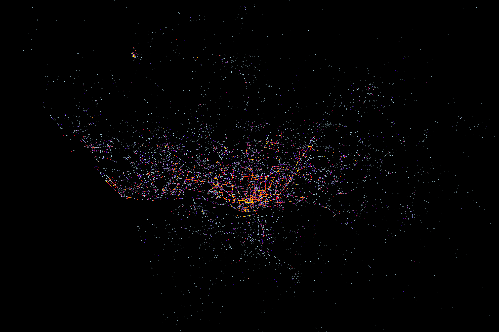</a></div>

*Linear-Normalized Heatmap:*  
<div align="center"><a href="common/heatmaps/endpoints_heatmap_porto_linear.png" target="_blank">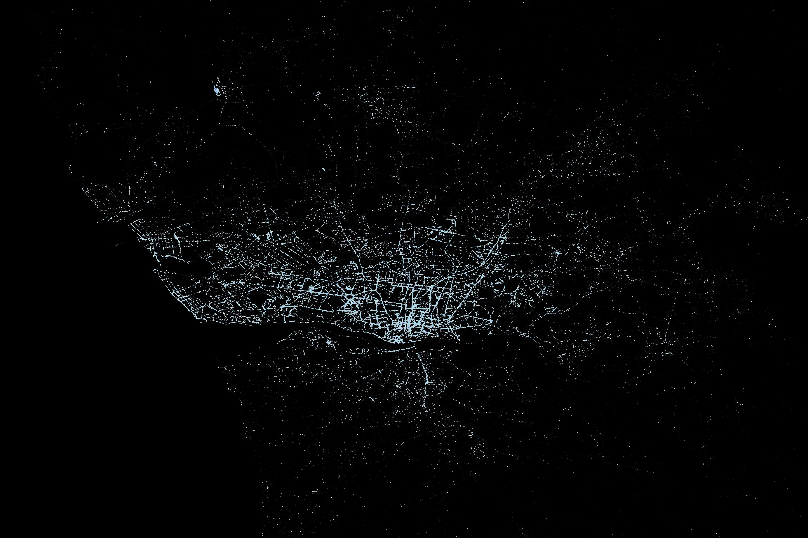</a></div>

*Logarithmic Heatmap:*  
<div align="center"><a href="common/heatmaps/endpoints_heatmap_porto_log.png" target="_blank">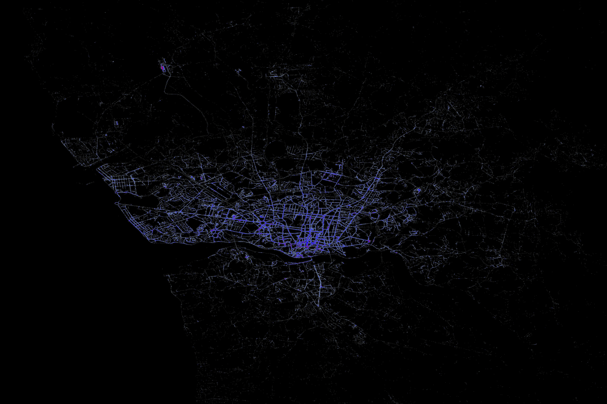</a></div>

---

## test_02: Επικάλυψη Heatmap σε Χάρτη (Map Overlay)

Στο δεύτερο πείραμα το παραγόμενο heatmap του `test_01` επικαλύφθηκε (overlay) πάνω σε έναν πραγματικό χάρτη του Πόρτο. Αυτή η εικόνα επιτρέπει στο μοντέλο να ταυτίσει την δραστηριότητα με πραγματικούς δρόμους και γειτονιές. Η εικόνα αυτή χρησιμοποιήθηκε ως είσοδος σε όλα τα υπόλοιπα πειράματα που αφορούν heatmaps.

**Παραγόμενη Εικόνα (Overlay):**

<div align="center"><a href="common/heatmaps/endpoints_heatmap_porto_overlay.png" target="_blank">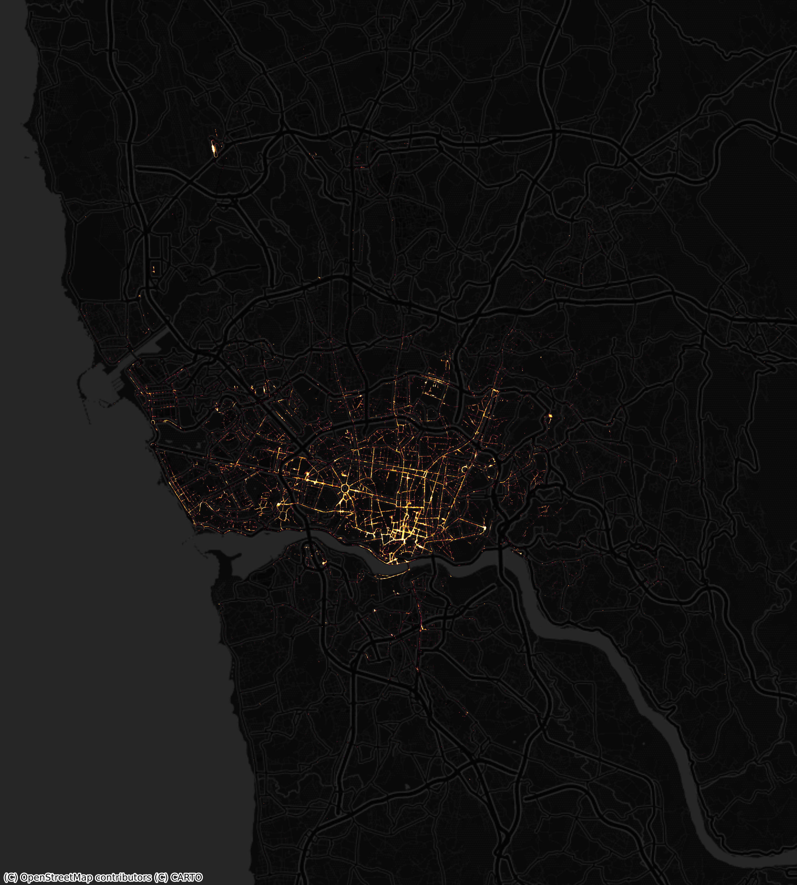</a></div>

---

## test_03: Παραγωγή Αφήγησης από το Heatmap

Δόθηκε στο μοντέλο η εικόνα που παρήχθη στο `test_02` και του ζητήθηκε να λειτουργήσει ως αφηγητής, εντοπίζοντας τα σημεία έντονης δραστηριότητας (hotspots) και γράφοντας μια ιστορία για αυτά. 

Σε αυτό το στάδιο δοκιμάστηκαν διαφορετικά Prompts για την εξαγωγή διαφορετικών στυλ ιστοριών:
* `HEATMAP_PROFESSIONAL_PROMPT`
* `HEATMAP_VISITOR_PROMPT`
* `HEATMAP_UNBIASED_PROMPT`

Τελικά επιλέχθηκε και καθιερώθηκε το **`HEATMAP_UNBIASED_PROMPT`**. Ο λόγος είναι ότι στα αρχικά prompts (π.χ. Visitor) υπήρχε ρητή αναφορά του ονόματος της πόλης. Σε δοκιμές που πραγματοποιήθηκαν με χάρτες άλλων περιοχών (π.χ. Αθήνα), διαπιστώθηκε ότι το LLM συνέχιζε να επιστρέφει POIs από το Πόρτο, αγνοώντας τα δεδομένα της εικόνας. Αυτό αποτελεί ένδειξη ότι το κείμενο του prompt υπερισχύει της οπτικής πληροφορίας ή ότι το μοντέλο δυσκολεύεται να αναγνωρίσει τη γεωγραφία αποκλειστικά από την εικόνα. Το Unbiased prompt αφαιρεί το όνομα της χώρας/πόλης, αναγκάζοντας το LLM να βασιστεί αποκλειστικά στα οπτικά δεδομένα για την ταυτοποίηση της τοποθεσίας. 

Ζητήθηκε επίσης η ταυτόχρονη εξαγωγή των POIs (Σημεία Ενδιαφέροντος) που εντόπισε το μοντέλο στην εικόνα σε μορφή JSON.

**HEATMAP_UNBIASED_PROMPT:**
```text
I will provide a PNG image representing a taxi activity heatmap. 
Your task is to act as an unbiased Geospatial Storyteller.
1. Identify the city and country shown in the base map.
2. Visually scan the image to find the exact area(s) where the bright heatmap color density is highest.
3. Note the geographic position of these specific hotspots.
4. Extract at least 15 POIs, landmarks, hospitals, or streets that are located EXACTLY underneath these visible hotspots.
...
```

**Δείγμα Εξαγόμενου JSON:**
```json
{
    "pois": [
        {
            "name": "São Bento Station"
        },
        {
            "name": "Clérigos Tower"
        },
        {
            "name": "Livraria Lello"
        }
    ]
}
```

**Παραγόμενη Ιστορία:**

> (A slow, sweeping shot reveals Porto at night, a dazzling network of golden lights pulsing across the map, each spark a taxi's endpoint, guiding your journey.)
> 
> Imagine Porto’s vibrant heartbeat, illuminated by the paths of discovery. Your adventure begins where the glow is brightest. Step out at **São Bento Train Station**, marveling at its iconic azulejo tiles. Follow the pulse to **Avenida dos Aliados**, Porto's grand central boulevard, leading to the soaring **Clérigos Tower** for breathtaking city views. Nearby, the enchanting **Livraria Lello** (a literary inspiration) beckons.
> 
> The vibrant hum guides you past the bustling **Mercado do Bolhão** (local culinary delights) and along **Rua de Santa Catarina**, home to the opulent **Café Majestic**. Descend to the historic **Porto Cathedral (Sé)** for panoramic vistas, then explore the exquisite **Palácio da Bolsa** with its stunning Arabian Room. The strongest glow leads to the riverside **Ribeira District**, a UNESCO site perfect for dining beside the majestic **Dom Luís I Bridge**.
> 
> Cross to Gaia for the famous **Port Wine Cellars** (essential tastings) and a scenic ride on the **Telefèrico de Gaia**. Westward, the lights guide you to the chic **Foz do Douro** beaches for sunsets, the serene **Serralves Museum** (modern art and gardens), and the architectural wonder of **Casa da Música** at **Rotunda da Boavista**, a major hub. Even **Campanhã Station**, a key transport link, and **Estádio do Dragão** (football fervor) have their bright spots. Let these vibrant paths illuminate your unforgettable Porto journey!

**Συμπέρασμα:** 
Το μοντέλο αναγνώρισε την πόλη και παρήγαγε μια αφήγηση. Ωστόσο, όπως αποδεικνύεται στα επόμενα πειράματα, το μοντέλο βασίστηκε στην εσωτερική του γνώση για τα πιο διάσημα τουριστικά μέρη του Πόρτο (π.χ. **São Bento Train Station** ή **Clérigos Tower**), αγνοώντας σε μεγάλο βαθμό το πραγματικό heatmap.

---

## test_04: Οπτικοποίηση των POIs

Στο στάδιο αυτό, πραγματοποιείται η οπτικοποίηση των Σημείων Ενδιαφέροντος (POIs) που εξήχθησαν από το LLM στο `test_03`. Τα σημεία αυτά αποτυπώνονται πάνω στον χάρτη του Πόρτο για να διαπιστωθεί οπτικά αν ταυτίζονται με τις περιοχές υψηλής δραστηριότητας.

Όπως φαίνεται στην παρακάτω εικόνα, τα POIs που πρότεινε το μοντέλο συμπίπτουν σε μεγάλο βαθμό με το heatmap. Αυτό είναι αναμενόμενο, καθώς τα σημεία αποβίβασης των ταξί (endpoints) συγκεντρώνονται φυσιολογικά γύρω από τα κυριότερα αξιοθέατα και σημεία ενδιαφέροντος της πόλης.

**Παραγόμενη Εικόνα:**
<div align="center"><a href="common/stories/porto_poi_map.png" target="_blank">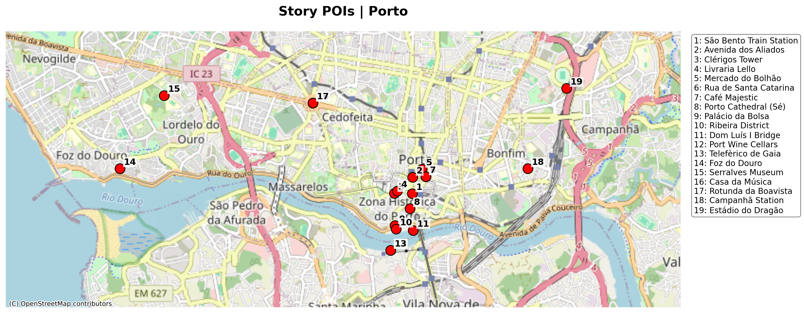</a></div>

---

## test_05: Παραγωγή Αφήγησης από Διαδρομή (Trajectory)

Χρησιμοποιώντας το αρχείο `trajectory.csv`, η διαδρομή απεικονίστηκε αρχικά στον χάρτη (κόκκινες τελείες). Στη συνέχεια, το περιεχόμενο του CSV δόθηκε ως είσοδος στο LLM μαζί με το παρακάτω prompt, ώστε το μοντέλο να περιγράψει μια συνεχή διαδρομή ταξί στο Πόρτο. Όπως και στα Heatmaps, εξάγονται τα POIs και οπτικοποιούνται πάνω στον χάρτη.

**TRAJECTORY_STORY_PROMPT:**
```text
I will provide a cvs file that contains a list of points
(longitude, latitude), that describe a trajectory of a taxi trip. Using
cinematic storytelling write a story about the trajectory. Mention
explicitly major road names, intersections, neighborhoods, local
POIs (e.g., restaurant name). Use 150 words maximum.
```

Όπως είναι εμφανές στην παρακάτω οπτικοποίηση, τα POIs που προτείνει το μοντέλο (μπλε αστέρια) εμφανίζονται σε εντελώς άσχετα σημεία σε σχέση με την πραγματική διαδρομή (κόκκινες τελείες). Αυτό επιβεβαιώνει την αδυναμία του μοντέλου να "δει" την ακριβή θέση της διαδρομής στην εικόνα, επιστρέφοντας πάλι τυχαία γνωστά σημεία της πόλης.

**Παραγόμενη Εικόνα:**
<div align="center"><a href="common/stories/porto_trajectory_map.png" target="_blank">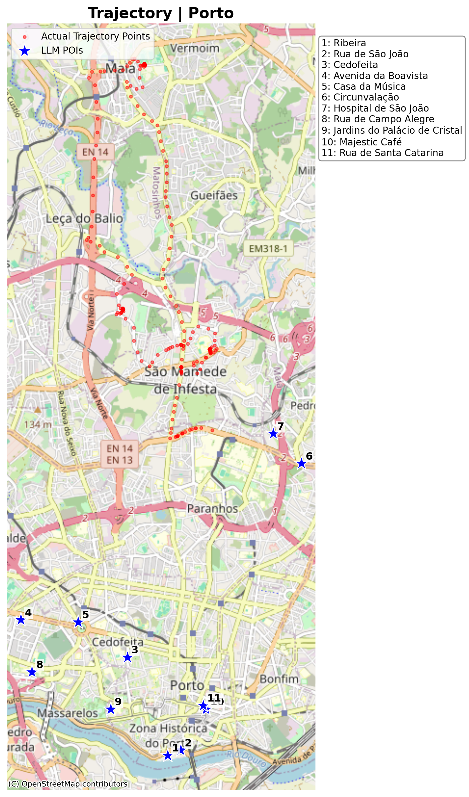</a></div>

**Δείγμα Παραγόμενης Ιστορίας:**
> The taxi idled by Ribeira’s ancient stones, overlooking the Douro. With a surge, it climbed steep Rua de São João, past flickering lamplight. We sped north through Cedofeita, art galleries blurring, then onto Avenida da Boavista, Casa da Música a futuristic marvel...

**Δείγμα Εξαγόμενων POIs (JSON):**
```json
[
    {
        "name": "Ribeira",
        "lon": -8.6138,
        "lat": 41.1408
    },
    {
        "name": "Rua de São João",
        "lon": -8.6115,
        "lat": 41.1415
    }
]
```

---

## test_06 & test_07: Πείραμα με "Ψεύτικα" (Fake) Hotspots (Πόρτο & Αθήνα)


Προκειμένου να αποδειχθεί αν το μοντέλο βασίζεται πραγματικά στην οπτική πληροφορία της εικόνας ή αν απλά "μαντεύει" βάσει της τοποθεσίας, δημιουργήθηκαν τεχνητά (fake) heatmaps. Σε αυτούς τους χάρτες, η δραστηριότητα μεταφέρθηκε σκόπιμα σε απομακρυσμένες περιοχές (βορειοανατολικά στο Πόρτο και στην περιοχή της Ραφήνας στην Αττική).

Χρησιμοποιήθηκε το **`HEATMAP_UNBIASED_PROMPT`**, το οποίο δεν αποκαλύπτει το όνομα της πόλης, αναγκάζοντας το μοντέλο να "σαρώσει" οπτικά την εικόνα.

**Αποτελέσματα:**
* Στο Πόρτο, το μοντέλο αγνόησε το ιστορικό κέντρο και εστίασε στην περιοχή όπου βρισκόταν η fake κηλίδα.
* Στην Αθήνα, το μοντέλο αναγνώρισε την πόλη και περιέγραψε μια ιστορία γύρω από την περιοχή της Ραφήνας, αγνοώντας πλήρως την Ακρόπολη και το κέντρο.

### Πείραμα Πόρτο (Fake Hotspot)

**Είσοδος (Fake Heatmap):**
<div align="center">
  <p>Fake Heatmap Πόρτο</p>
  <a href="common/heatmaps/endpoints_heatmap_porto_fake.png" target="_blank">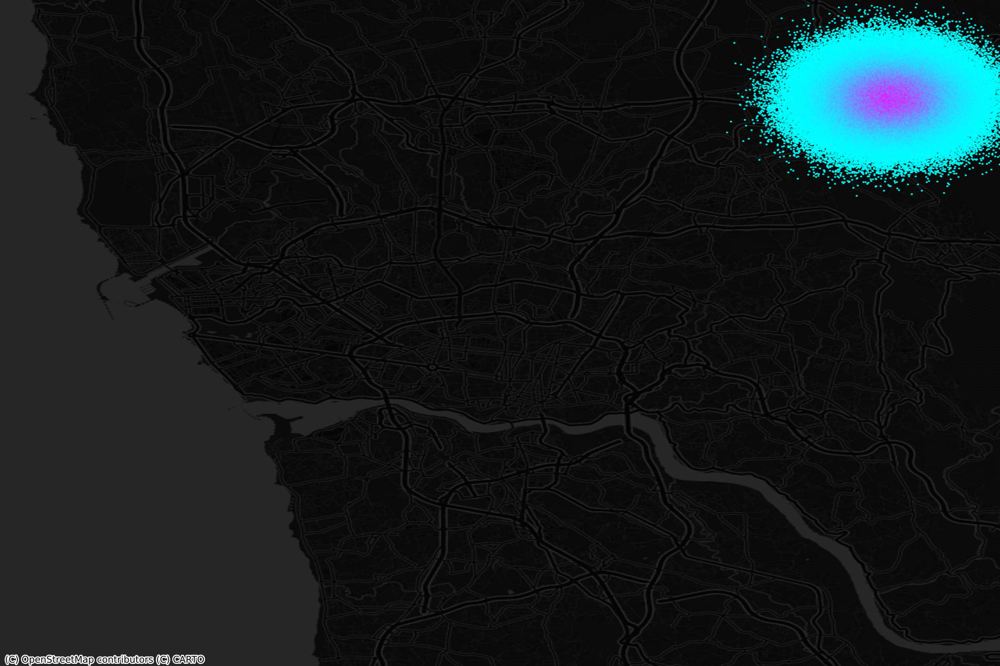</a>
</div>

**Αποτέλεσμα (Οπτικοποίηση POIs):**
<div align="center">
  <p>Fake Hotspot Πόρτο (Unbiased Output)</p>
  <a href="common/stories/porto_fake_map_unbiased.png" target="_blank">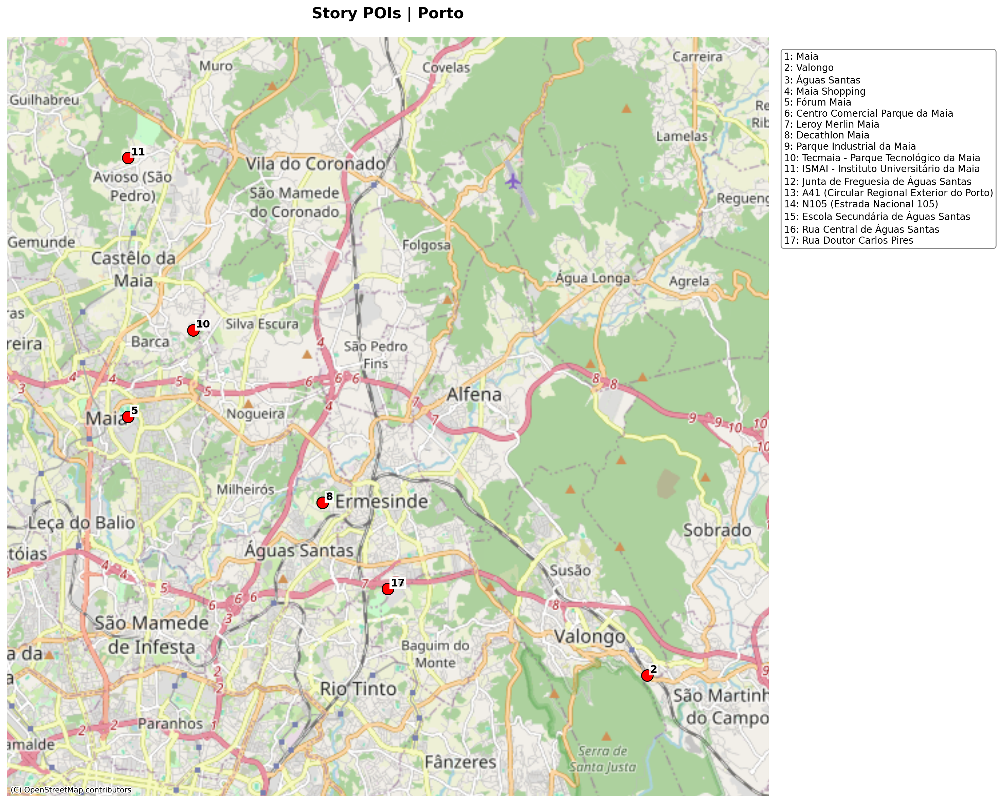</a>
</div>

**Παραγόμενη Ιστορία (Porto Fake):**
> Welcome to **Porto, Portugal**! As you look at this heatmap, you'll notice a singular, intense beacon of activity, far from the historic downtown. This vibrant hotspot pulses in the northeastern part of the map, primarily encompassing the municipalities of **Maia** and **Valongo**, centered around the bustling area of **Águas Santas**.
> Imagine stepping into this dynamic zone. The brightest magenta core indicates a constant flow around major retail hubs like **Maia Shopping**, **Fórum Maia**, and the **Centro Comercial Parque da Maia**, where locals frequent **local supermarkets** and big-box stores like **Leroy Merlin Maia** and **Decathlon Maia**.

---

### Πείραμα Αθήνας (Fake Hotspot)
<div align="center">
  <p>Fake Heatmap Αθήνα (Περιοχή Ραφήνας)</p>
  <a href="common/heatmaps/endpoints_heatmap_athens_fake.png" target="_blank">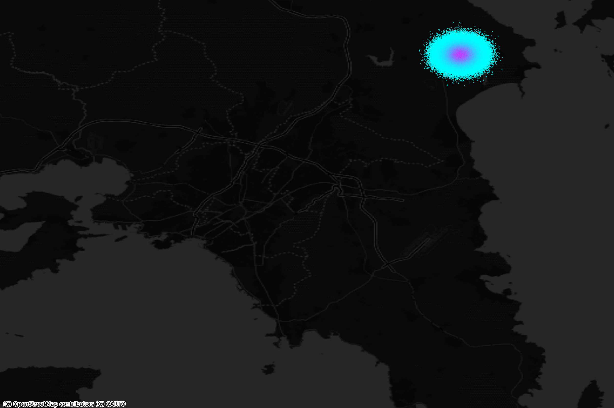</a>
</div>

**Αποτέλεσμα (Οπτικοποίηση POIs):**
<div align="center">
  <p>Fake Hotspot Αθήνα (Unbiased Output)</p>
  <a href="common/stories/athens_fake_map_athens_unbiased.png" target="_blank">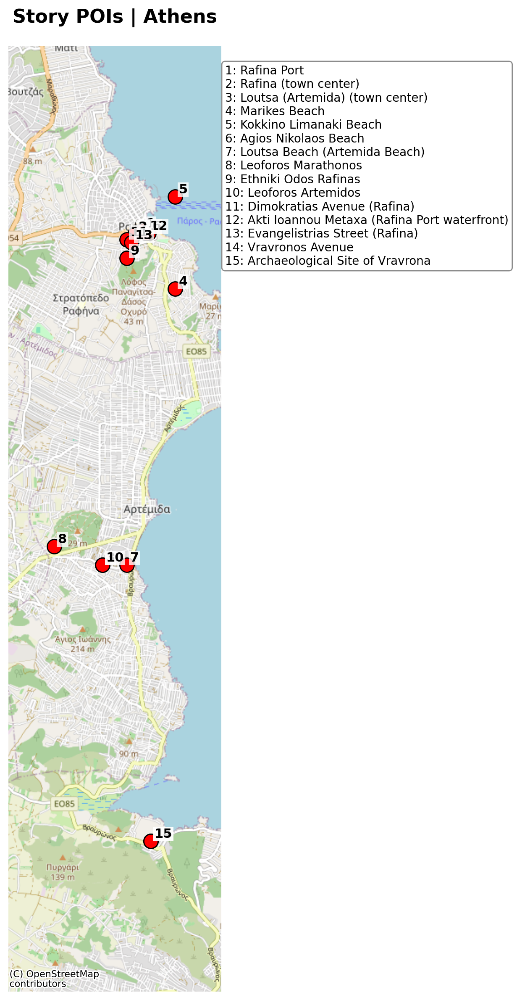</a>
</div>

**Παραγόμενη Ιστορία (Athens Fake):**
> The predawn hum of engines, the splash of waves – welcome to the vibrant heartbeat of **Rafina**, Greece. This isn't the ancient city center you might expect, but a bustling coastal hub, revealed by the radiant glow of taxi activity on our map.
> Our data tells a story of constant motion around **Rafina Port**, the primary gateway to the Cycladic islands, making it a hotspot for arrivals and departures. Taxis converge here, weaving through **Ethniki Odos Rafinas** and **Dimokratias Avenue**, ferrying travelers and locals.


---

## test_08 - test_11: Αξιολόγηση Geocoding & Validation Layer

**Περιγραφή:**
Για την επικύρωση των POIs που προτείνει το LLM, γίνεται σύγκριση των συντεταγμένων που "φαντάζεται" το μοντέλο με τις πραγματικές συντεταγμένες. 

Στα **tests 08, 09 και 10** πραγματοποιήθηκαν δοκιμές με τους 3 κυριότερους "free" (ή freemium) geocoders, ενώ στο **test 11** έγινε η συγκριτική τους αξιολόγηση:
1. **Google Geocoding API**
2. **Nominatim (OpenStreetMap)**
3. **ArcGIS**

**Συμπέρασμα Αξιολόγησης:**
Το **Google Geocoding API** αποδείχθηκε η πιο αξιόπιστη λύση. Παρόλο που το LLM συχνά παρέχει ονόματα με μικρά σφάλματα ή ασαφείς περιγραφές, η Google κατάφερε να ταυτοποιήσει τα σημεία με τη μεγαλύτερη ακρίβεια, επιτρέποντας τον υπολογισμό της απόκλισης (deviation). 

**Χάρτες Σύγκρισης (LLM vs API):**
Οι παρακάτω χάρτες δείχνουν τη διαφορά μεταξύ της θέσης που "νόμιζε" το LLM (μπλε σημεία) και της πραγματικής θέσης που επιβεβαίωσε το API (κίτρινα αστέρια).

<div align="center">
  <p>Σύγκριση Πόρτο (LLM vs Google)</p>
  <a href="common/stories/porto_google_comparison_map.png" target="_blank">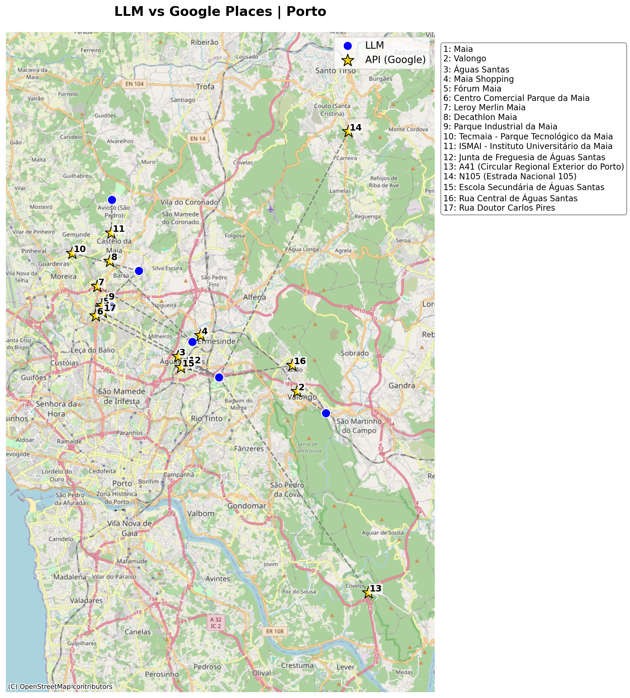</a>
  <br><br>
  <p>Σύγκριση Αθήνα (LLM vs Google)</p>
  <a href="common/stories/athens_google_comparison_map.png" target="_blank">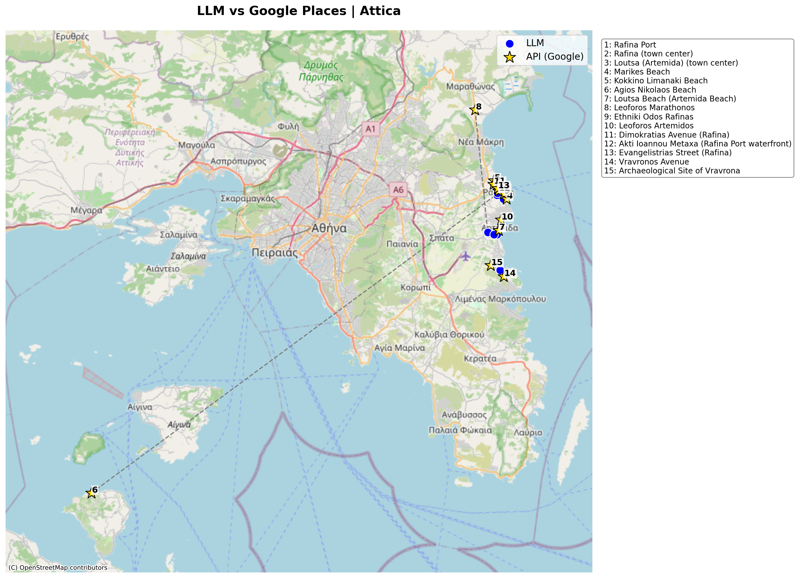</a>
</div>

**Δείγμα JSON Αξιολόγησης (test_11):**
```json
[
    {
        "name": "Google",
        "hits": 11,
        "total": 11,
        "results": [
            {
                "name": "Ribeira",
                "llm_lon": -8.6138,
                "llm_lat": 41.1408,
                "api_lon": -8.6103135,
                "api_lat": 41.1432682,
                "diff_distance_meters": 401.0
            }
        ]
    }
]
```

---

## test_12: Αξιολόγηση (Deviation Calculation)

Στο test αυτό πραγματοποιείται η μέτρηση των αποτελεσμάτων του `test_05`. Ενώ στο `test_05` η απόκλιση ήταν ορατή μόνο οπτικά, εδώ υπολογίζεται με ακρίβεια η απόκλιση (deviation) σε μέτρα κάθε POI από την πραγματική διαδρομή (trajectory).


**Παραγόμενη Εικόνα (Deviation Map):**
<div align="center"><a href="common/stories/porto_trajectory_deviation_map.png" target="_blank">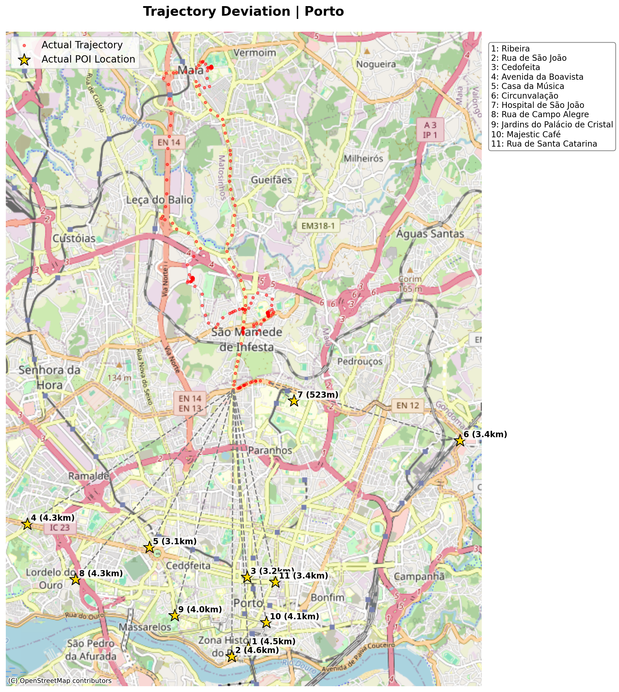</a></div>

**Δείγμα JSON Αποτελεσμάτων (test_12):**
```json
[
    {
        "name": "Hospital de São João",
        "llm_lon": -8.595,
        "llm_lat": 41.184,
        "api_lon": -8.6008841,
        "api_lat": 41.1816284,
        "diff_distance_meters": 559.6,
        "distance_to_trajectory_meters": 523.2
    }
]
```

**Επεξήγηση Πεδίων JSON:**
* **llm_lon/lat**: Οι συντεταγμένες που "μάντεψε" το μοντέλο.
* **api_lon/lat**: Οι πραγματικές συντεταγμένες από το Google.
* **diff_distance_meters**: Η απόσταση μεταξύ των δύο παραπάνω.
* **distance_to_trajectory_meters**: Η απόσταση του POI από το πλησιέστερο (nearest) σημείο της πραγματικής διαδρομής.

---

## test_14: Agentic Workflow (Self-Correction)


Στο test αυτό, εφαρμόστηκε ένας μηχανισμός αυτο-διόρθωσης. Ο **Control Agent** υπολογίζει την απόκλιση και, αν αυτή υπερβαίνει ένα όριο (π.χ. 200 μέτρα), ζητά από το μοντέλο να ξαναγράψει την ιστορία, παρέχοντάς του το σκορ της απόκλισης ως feedback.

**Αποτέλεσμα:**
Το μοντέλο, παρόλο που προσπάθησε να συμμορφωθεί, απέτυχε να μειώσει την απόκλιση σημαντικά. Αυτό απέδειξε ότι η ανατροφοδότηση από μόνη της δεν αρκεί αν το μοντέλο δεν έχει πρόσβαση σε εξωτερική γνώση (μέσω κάποιου API).

**Χάρτης Απόκλισης (Self-Correction):**
<div align="center"><a href="common/stories/porto_agentic_story_map.png" target="_blank">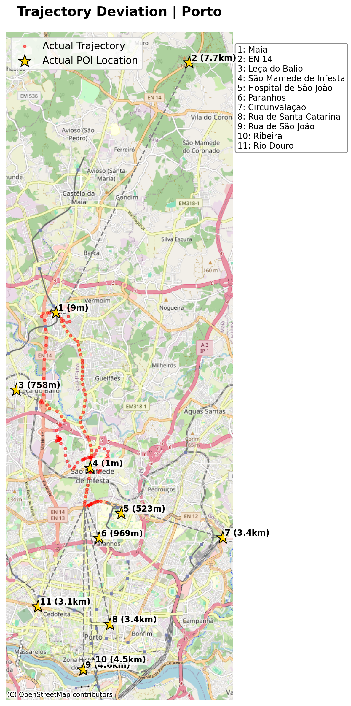</a></div>

**Δείγμα JSON Αποτελεσμάτων (test_14):**
```json
{
    "title": "The Douro Dawn Drive",
    "pois": [
        {
            "name": "Hospital de São João",
            "distance_to_trajectory_meters": 523.2
        },
        {
            "name": "Ribeira",
            "distance_to_trajectory_meters": 4463.4
        }
    ]
}
```

---

## test_15: Agentic RAG Workflow (Spatial Grounding)

Αποτελεί την πιο επιτυχημένη προσέγγιση. Χρησιμοποιείται ο **Discovery Agent** ο οποίος, πριν την κλήση του LLM, αναζητά μέσω του **Google Places API** πραγματικά POIs που βρίσκονται αυστηρά πάνω στη διαδρομή. Αυτά τα σημεία παρέχονται στο prompt ως grounding.

**Αποτέλεσμα:**
Η απόκλιση εκμηδενίστηκε (κάτω από 100 μέτρα). Το μοντέλο ενσωμάτωσε τα πραγματικά POIs στην αφήγηση, παράγοντας μια ιστορία που είναι γεωγραφικά ακριβής και ταυτίζεται απόλυτα με την εικόνα της διαδρομής.

**Χάρτης Απόκλισης:**
<div align="center"><a href="common/stories/porto_agentic_rag_story_map.png" target="_blank">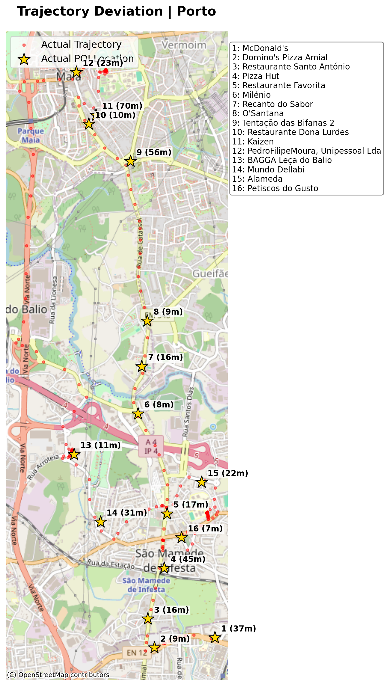</a></div>

---

## Δομή του Project

* **`agents/`**: Περιέχει τον κεντρικό ενορχηστρωτή (`control_agent.py`) που διαχειρίζεται το feedback loop.
* **`story/`**: Μηχανές παραγωγής ιστοριών από Heatmaps και Trajectories.
* **`utils/`**: Εργαλεία για Spatial RAG (`places_fetcher.py`) και υπολογισμό αποκλίσεων (`deviation_math.py`).
* **`geocoders/`**: Υλοποιήσεις για επικύρωση συντεταγμένων μέσω Google, ArcGIS και Nominatim.
* **`visualization/`**: Scripts για τη δημιουργία των χαρτών και των οπτικοποιήσεων.
* **`tests/`**: Όλα τα πειραματικά στάδια του project.
* **LLM Engine**: Σε όλα τα στάδια του project χρησιμοποιήθηκε το μοντέλο **Gemini-2.5-Flash** της Google.

---

## Εγκατάσταση & Εκτέλεση

1. **Ρύθμιση Περιβάλλοντος**:
   Δημιουργήστε ένα αρχείο `.env` σύμφωνα με το πρότυπο του αρχείου `.env.sample` με τα απαραίτητα κλειδιά:
   ```env
   GEMINI_API_KEY=your_key_here
   GOOGLE_MAPS_API_KEY=your_key_here
   ```

2. **Εκτέλεση Πειραμάτων**:
   Κάθε τεστ μπορεί να εκτελεστεί ως αυτόνομο module. Για παράδειγμα, για την εκτέλεση του τελικού Agentic RAG πειράματος:
   ```bash
   python -m tests.test_15_agentic_rag_workflow
   ```


